# SimReady Blender CORE Add-on Artist Tools Reference Guide


# Table of Contents


- [Introduction](#introduction)
- [Prerequisites](#prerequisites)
- [Installation](#installation)
   - [Download or build a local copy of the Blender add-on](#download-or-build-local-copy-of-blender-add-on).
   - [Install the add-on](#install-the-blender-add-on).
   - [Set up your project configuration](#set-up-your-project-configuration).
- [Where to Find the Panels](#where-to-find-the-panels)
- [CORE N-Panel Reference](#core-n-panel-reference)
   - [Main / Version](#main--version)
   - [Learning](#learning)
   - [Asset Mgmt](#asset-mgmt)
   - [Make Source Directories](#make-source-directories)
   - [Quick Tools](#quick-tools)
   - [SimReady Metadata](#simready-metadata)
   - [MJCF (MuJoCo) to USD](#mjcf-mujoco-to-usd)
   - [Setup SimReady Export Collections](#setup-simready-export-collections)
   - [USD Physics Joint Attributes](#usd-physics-joint-attributes)
   - [Grasp Setup](#grasp-setup)
   - [Thumbnailer](#thumbnailer)
   - [Asset Profiles](#asset-profiles)
   - [SimReady Checklist](#simready-checklist)
   - [Logs](#logs)
   - [Preflight & Export](#preflight--export)
- [Properties Editor Panels](#properties-editor-panels)
   - [Object → Wikidata Metadata](#object--wikidata-metadata)
   - [Object Data → Wikidata Metadata](#object-data--wikidata-metadata)
   - [Material → SimReady Non-Visual Settings](#material--simready-non-visual-settings)
   - [Object → Dense Captions](#object--dense-captions)
- [File Menu Integrations](#file-menu-integrations)
- [USD Hook](#usd-hook)
- [Appendix — Troubleshooting](#appendix--troubleshooting)


## Introduction


This is the SimReady Blender Add-on for Blender. Use it to set up, validate, and export SimReady-neutral USD assets, and capitalize on a growing set of authoring panels for SimReady metadata, physics joints, MuJoCo (MJCF) import, vehicle attributes, thumbnail rendering, and more, as they become available. It is under active development and updated regularly. This document describes the Blender add-on’s high-level capabilities, and is intended for Content Creators experienced in Blender.


## Prerequisites

Requirements:

   - Windows 10 or Windows 11 (tested on Windows 11)
   - SimReady Foundations and dependencies (latest version)
   - Blender 5.0 or later (5.1 recommended)


### SimReady Foundation

Repository location: <a href="https://github.com/NVIDIA/simready-foundation" target="_blank" rel="noopener noreferrer">SimReady Foundation</a>  

1. Follow the README.md instructions to clone the repo to your hard drive. 
2. When you've cloned the repository, look for two folders:
   - **nv_core**
   - **sample_content** 

3. You can either copy those two folders into a new folder (which you make yourself called `C:\sr_dev\foundations\`), or you can use the cloned repository. This guide assumes you have copied the folders to `C:\sr_dev\foundations\`.

You should now have a `C:\sr_dev\foundations\nv_core` folder and a `C:\sr_dev\foundations\sample_content` folder.


Additional references:


- <a href="https://nvidia.github.io/simready-foundation/guides/getting_started.html" target="_blank" rel="noopener noreferrer">SimReady Getting Started guide</a>  

- <a href="https://nvidia.github.io/simready-foundation/index.html" target="_blank" rel="noopener noreferrer">SimReady Foundation - Content Guidelines and Requirements</a>  


### Internet Connection


An internet connection is required on first launch and for each add-on upgrade, to install Python dependencies (PySide6, Pillow, PyTorch, Transformers, Markdown, and others) and to allow the Wikidata search panel to reach the Wikidata API.


After the initial setup or an upgrade, an internet connection is required only to access AWS asset libraries.


## Installation


At a high level, you take this sequence of actions to install the Blender add-on:


1. [Download or build a local copy of the Blender add-on](#download-or-build-local-copy-of-blender-add-on).
2. [Install the add-on](#install-the-blender-add-on).
3. [Configure the add-on for your project](#set-up-your-project-configuration).


### Download or Build Local Copy of Blender Add-on


The SimReady Blender Add-on is built and distributed as a single `.zip` file from the Blender add-on repository. How you acquire or build a copy of the add-on depends on whether you are using the standard version, or extending a version for your own use.


#### To Use Pre-Built Add-on


To use the pre-built version of the Blender add-on, download the add-on zip file.


1. In a browser, go to <a href="https://github.com/NVIDIA/simready-blender-add-on/releases/tag/Latest" target="_blank" rel="noopener noreferrer">SimReady Blender Add on release</a>  .
2. Download **SimReady_Blender_CORE_2026.4.0.zip**.
3. By default, the download goes to "C:\<User>\Downloads"; you do not need to move it.


#### To Build Custom Add-on


To create a custom version of the add-on for your own use, fork the main branch of the Blender add-on repository, clone the fork, make your changes to your copy of the source, and then create a local Blender add-on zip file from your source files:


In a browser, go to <a href="https://github.com/NVIDIA/simready-blender-add-on" target="_blank" rel="noopener noreferrer">SimReady Blender Addon Github</a> 

 

1. Fork the main branch of the repository for your work (first time only).
2. Clone the forked copy of the repository:

   ```bash
   cd simready-blender-add-on
   git clone <forked copy>
   ```

3. Update Blender source files as appropriate.
4. Build the add-on zip:

   ```bash
   python CORE_SysUtils/package/make_core_zip.py
   ```

The Python script creates `SimReady_Blender_CORE_<version>.zip` (for example, `SimReady_Blender_CORE_2026.4.0.zip`) at the repo root. The zip file contains both `CORE_ArtistTools/` and `CORE_ArtistTools_Resources/`, which are essential operations and functions that form the foundation of Blender’s interface and workflow.


### Install the Blender Add-on


Open Blender’s add-on preferences.


1.The SimReady Blender Add-on package is named `SimReady_Blender_CORE_<version>.zip`. You can either download the zip from the release section here `Public Link Needed`, or follow instructions in this repo's `README.md` to package a zip file from the source files in the repo. 

You use **Blender Preferences** to install the SimReady Blender Add-on, as follows:

1. Go to your Blender application.
2. Open **Blender Preferences**.

   

3. Click **Edit (1)**.  
4. Click **Preferences… (2)**.

   

5. Click **Add-ons (1)**.  
6. Click the down arrow **(2)** on the top right corner of the window, adjacent to tag icon. 
7. Click **Install from Disk…** **(3)** from the dropdown.  

   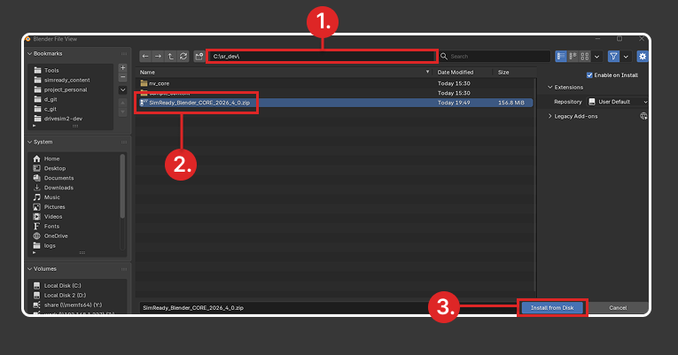

8. Navigate to the `SimReady_Blender_CORE_2026.4.0.zip` file. **(1)**.  
9. Select `SimReady_Blender_CORE_2026.4.0.zip`. **(2)**  
10. Click **Install from Disk** **(3)**.

Wait for the installation to complete; it might take a few minutes depending on your internet speeds. Subsequent installs should be much faster.


### Set up Your Project Configuration

#### Link the SimReady Blender Add-on to SimReady Foundations

For the SimReady Blender Add-on to work smoothly, it needs to have a connection to SimReady Foundations. You create that connection by initializing pointers in the `project_config.toml` configuration file that Blender uses. The `project_config.toml` file is included in the **SimReady Foundations** **package**. 

Follow these steps to set it up. They assume you have already set up [Foundations](#simready-foundation), which is required.

1. Go to **Edit\->Preferences** in the menu bar at the top of the Blender interface.

   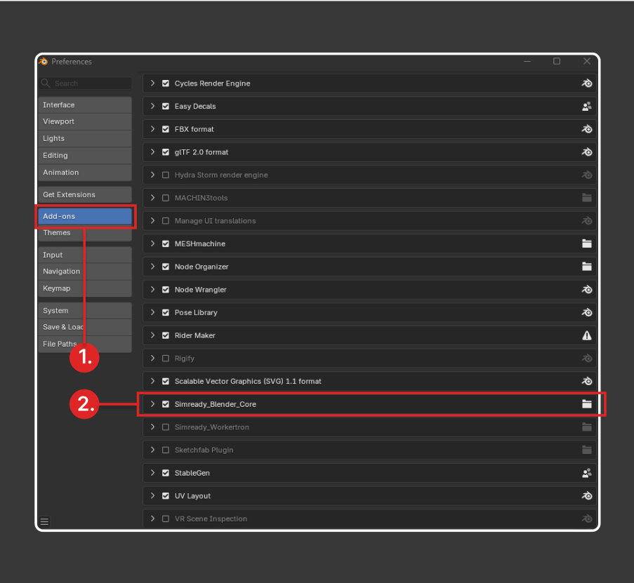

2. In the **Preferences** window, click **Add-ons (1)** on the left side.  
3. Find the **SimReady_Blender_Core** add-on in the main panel **(2)** and click its expansion icon.  

   **Note:** **SimReady Blender Core** is just another name for the **SimReady Blender Add-on**. They are both referring to the same set of tools.

You now need to link the **SimReady Blender CORE** to **SimReady Foundation** functions so its tools can use the Foundation's services.

   

4. Click the expansion icon to expand the **SimReady_Blender_Core** preferences. **(1)**
5. Click the folder icon **(2)**  in **General Settings** (the folder icon inside a red rectangle) to open a file picker to navigate to `project_config.toml`.  

   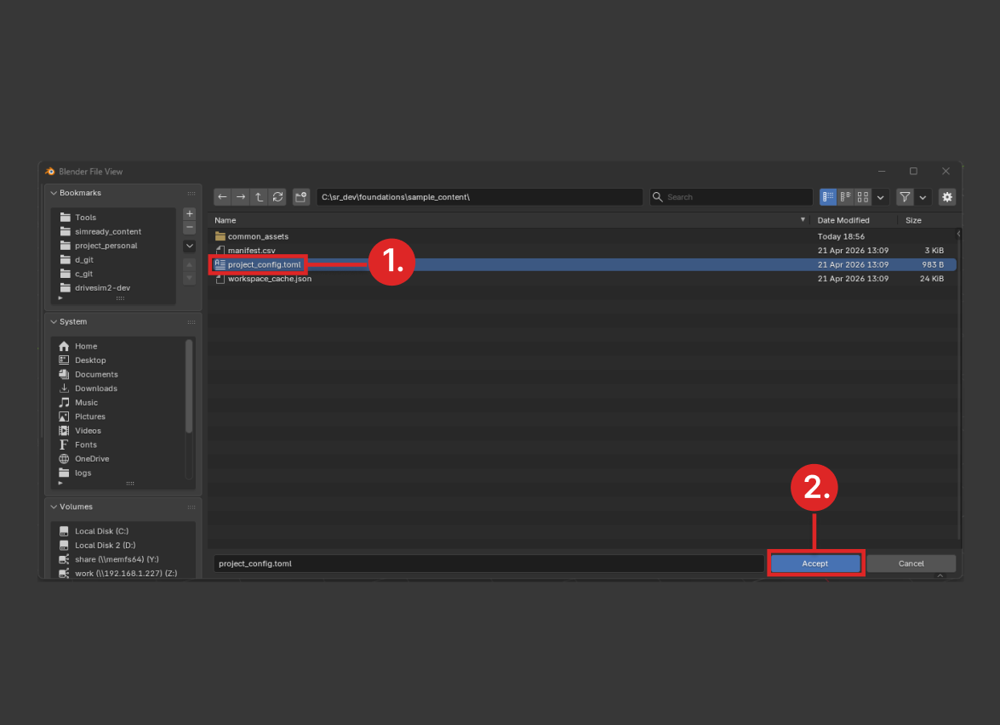

6. Locate the `project_config.toml` file located at `<foundations>\sample_content\project_config.toml`. **(1)**  
7. Click **Accept. (2)**

     

All file paths (“Pick config file”, “Project Root”, “nv_core”, “Source Folder”) should now point to the Foundations folders necessary for the SimReady Blender Add-on to function properly. If these folder paths remain empty, go back to Step 1, re-select the `project_config.toml` file, and click **Accept**.

#### Troubleshooting SimReady Blender Add-on Installation Issues

If you are installing the **SimReady Blender Add-on** for the first time, you might be prompted to restart **Blender** because the install scripts run upon **init**. 

  

When you restart, your SimReady Blender Add-on should initialize correctly.

**Important: Always restart Blender after installing the SimReady Blender Add-on** (the first time, and after any future upgrades or updates). The SimReady Blender Add-on does not refresh during an active Blender session.

\*Pip is Python’s package installer, usually from <a href="https://pypi.org" target="_blank" rel="noopener noreferrer">PyPI</a>.


### Where to Find the Panels


The Blender add-on installs user interface elements in several places, not just the CORE **N-panel**. Here is a quick map:


| Location | Contents |
|---|---|
| **3D View → N-panel → CORE tab** | Main / Learning / Asset Mgmt / Quick Tools / SimReady Metadata / MJCF / Export Collections / Joint Attributes / Grasp Setup / Thumbnailer / Asset Profiles / Checklist / Logs / Preflight & Export |
| **Properties → Object** | Wikidata Metadata, Dense Captions |
| **Properties → Object Data (mesh)** | Wikidata Metadata (read/remove view) |
| **Properties → Material** | SimReady Non-Visual Settings |
| **File → Export** | SimReady USD (`.usd`) |
| **File → Import** | SimReady USD, MJCF (MuJoCo) (`.xml`) |
| **Background** | `SimReady_USDHook` participates in USD I/O |

> NOTE: The **N-Panel** in Blender is a side panel in the 3D Viewport that provides access to object properties, transform settings, viewport controls, and workspace-specific tools


### Troubleshooting Add-on Installation Issues


When first installing the SimReady Blender add-ons, Blender may prompt you to restart, because the install scripts run on init. You may also see an exception due to internet speed, timing, or Python cache generation.


> Recommend restart Blender after every install or upgrade; add-ons do not refresh while a session is active.

> Pip is Python’s package installer, usually from <a href="https://pypi.org/" target="_blank" rel="noopener noreferrer">PyPI</a>.


## CORE N-Panel Reference


This panel/tool is located in Blender’s **N-panel** under the **CORE** tab.
> The hotkey in Blender is "n". Be sure your mouse is hovered over the viewport before pressing "n".


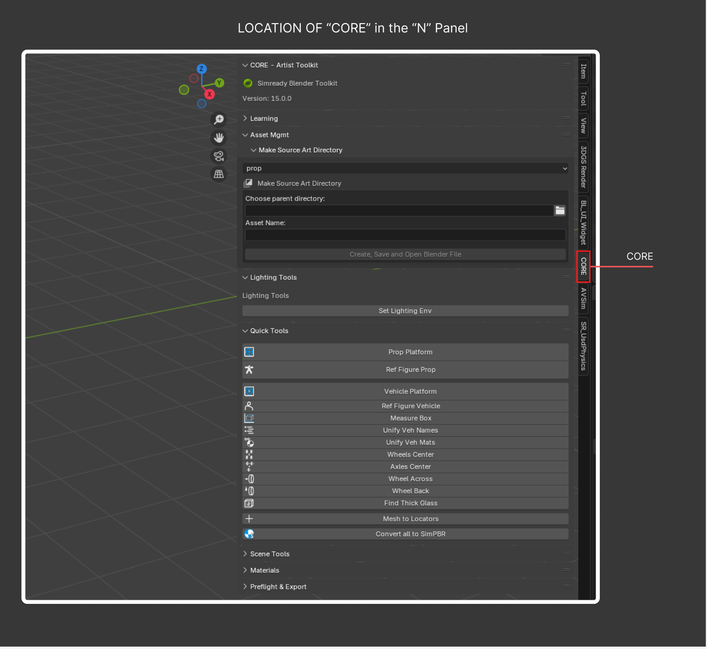


The **CORE** tab contains the following panels. 


### SimReady Blender Toolkit
`CORE_PT_main_panel`: Header panel that displays the **add-on name** and **version**.

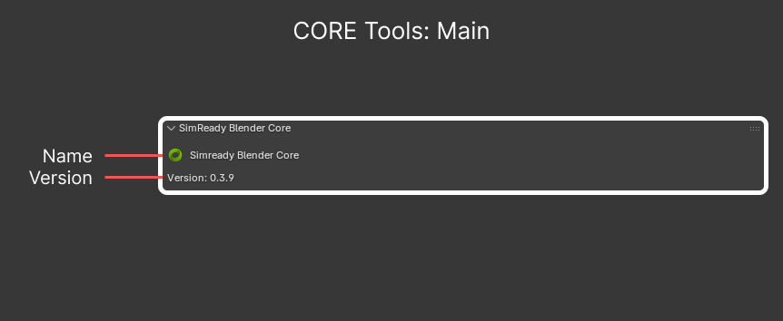


> `CORE_PT_main_panel` refers to the class names within the addon.  This could be useful reference for developers later.


### Learning
`CORE_PT_Documentation`: Opens this document (you are reading) in your default browser from Blender interface.

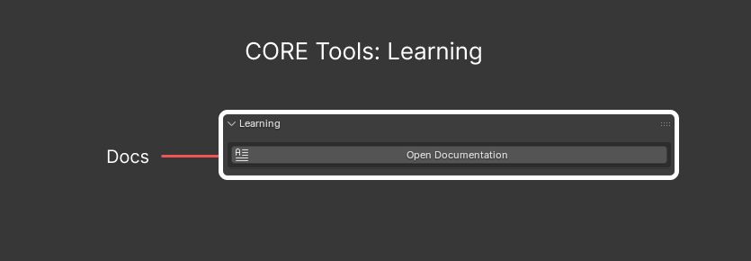

**NOTE:** We have provided some video guides. You can download them directly from the repo at [`docs/faq_helpers`](../docs/faq_helpers) or click on the links to directly download:

| # | Title | Video |
|---|-------|-------|
| 1 | How to install the CORE tool add-on | <a href="https://github.com/NVIDIA/simready-blender-add-on/blob/main/Docs/faq_helpers/1_How_to_install_core_tool_addon.mp4" target="_blank" rel="noopener noreferrer">1_How_to_install_core_tool_addon.mp4</a> |
| 2 | How to access CORE tool log files | <a href="https://github.com/NVIDIA/simready-blender-add-on/blob/main/Docs/faq_helpers/2_How_to_access_core_tool_log_files.mp4" target="_blank" rel="noopener noreferrer">2_How_to_access_core_tool_log_files.mp4</a> |
| 3 | How to create SimReady collections | <a href="https://github.com/NVIDIA/simready-blender-add-on/blob/main/Docs/faq_helpers/3_How_to_create_Sim_Ready_Collections.mp4" target="_blank" rel="noopener noreferrer">3_How_to_create_Sim_Ready_Collections.mp4</a> |
| 4 | How to import MJCF assets | <a href="https://github.com/NVIDIA/simready-blender-add-on/blob/main/Docs/faq_helpers/4_How_to_import_MJFC_assets.mp4" target="_blank" rel="noopener noreferrer">4_How_to_import_MJFC_assets.mp4</a> |
| 5 | How to add grasp points | <a href="https://github.com/NVIDIA/simready-blender-add-on/blob/main/Docs/faq_helpers/5_How_to_add_grasp_points.mp4" target="_blank" rel="noopener noreferrer">5_How_to_add_grasp_points.mp4</a> |
| 6 | How to create unibody joints | <a href="https://github.com/NVIDIA/simready-blender-add-on/blob/main/Docs/faq_helpers/6_How_to_create_uni_body_joints.mp4" target="_blank" rel="noopener noreferrer">6_How_to_create_uni_body_joints.mp4</a> |
| 7 | How to set up fixed joints | <a href="https://github.com/NVIDIA/simready-blender-add-on/blob/main/Docs/faq_helpers/7_How_to_setup_fixed_joints.mp4" target="_blank" rel="noopener noreferrer">7_How_to_setup_fixed_joints.mp4</a> |
| 8 | How to set up revolute (hinge) joints | <a href="https://github.com/NVIDIA/simready-blender-add-on/blob/main/Docs/faq_helpers/8_How_to_setup_revolute(hinge)_joints.mp4" target="_blank" rel="noopener noreferrer">8_How_to_setup_revolute(hinge)_joints.mp4</a> |
| 9 | How to set up prismatic joints | <a href="https://github.com/NVIDIA/simready-blender-add-on/blob/main/Docs/faq_helpers/9_How_to_setup_prismatic(slider)_joints.mp4" target="_blank" rel="noopener noreferrer">9_How_to_setup_prismatic(slider)_joints.mp4</a> |
| 10 | How to create folder structure automatically | <a href="https://github.com/NVIDIA/simready-blender-add-on/blob/main/Docs/faq_helpers/10_How_to_create_folder_structure_automatically.mp4" target="_blank" rel="noopener noreferrer">10_How_to_create_folder_structure_automatically.mp4</a> |
| 11 | How to find intersecting geometry | <a href="https://github.com/NVIDIA/simready-blender-add-on/blob/main/Docs/faq_helpers/11_How_to_find_intersecting_geometry.mp4" target="_blank" rel="noopener noreferrer">11_How_to_find_intersecting_geometry.mp4</a> |


### Asset Mgmt (Asset Management)
`CORE_PT_Asset`: Sets up the on-disk folder structure for a new asset and saves the asset file in the correct location. Follow this structure because many tools depend on it.

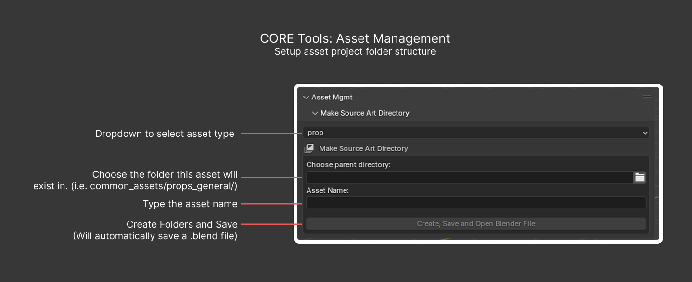


#### Dropdown: Asset Classification
This dropdown menu is currently focused on **Props**. It also exposes legacy DriveSim classes (Vehicles), but **Props** is the default and the only classification under active development for the **Blender SimReady Add on**.

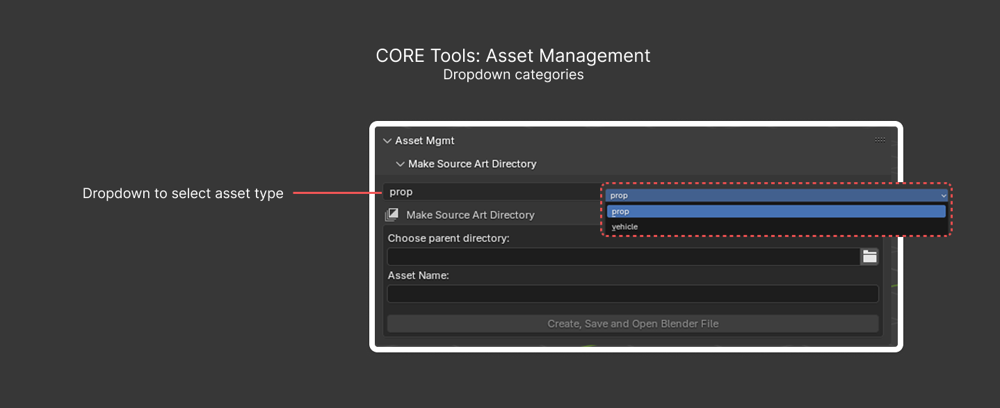


#### Make Source Directories


`CORE_PT_make_source_dir`: Helper tool to make an asset source directory.

Download this helper video if you want a guide on how to use Asset Mgmt too: <a href="https://github.com/NVIDIA/simready-blender-add-on/blob/main/Docs/faq_helpers/10_How_to_create_folder_structure_automatically.mp4" target="_blank" rel="noopener noreferrer">10_How_to_create_folder_structure_automatically.mp4</a>


The resulting folder structure:

```text
Asset
├── dcc_source
│   └── working
│       ├── image
│       │   ├── graphics
│       │   ├── progress
│       │   └── reference
│       ├── model
│       │   ├── 3dsmax
│       │   ├── blender
│       │   ├── fbx
│       │   ├── houdini
│       │   ├── maya
│       │   └── zbrush
│       ├── original
│       └── texture
│           ├── designer
│           ├── painter
│ 
```   


### Quick Tools


`CORE_PT_Tools`: Small utilities and helpers for asset setup.:


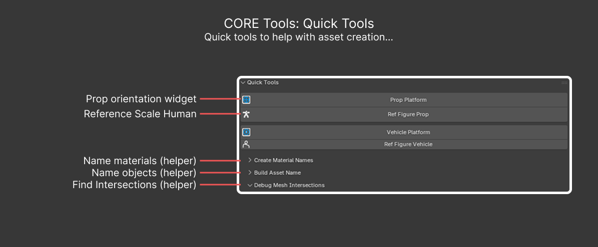


#### Prop Platform (prop orientation widget)


A simple orientation widget. Assets can be authored from any direction: Omniverse uses a "Z-up", "X-forward" orientation, but Blender often pushes you toward “Y-forward.” Use this widget to reference the asset’s orientation.


#### Ref Figure Prop


A standard 6 ft / 1.82 meter male figure for scale reference.


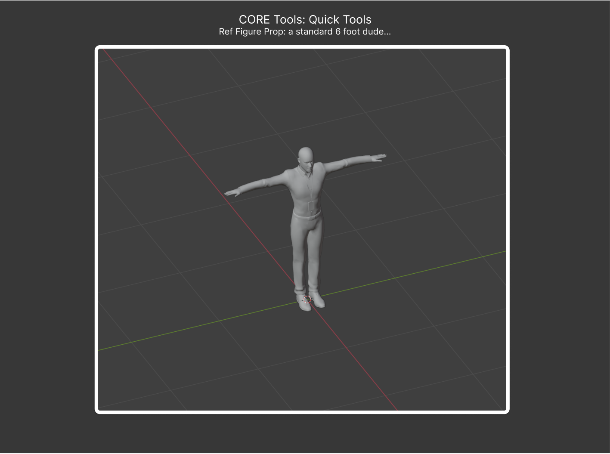


#### Child Sub-panels


- **Create Material Names** (`CORE_PT_Build_Mat_Name`): Assemble a standardized material name and copy it to the clipboard.
- **Build Asset Name** (`CORE_PT_Build_Asset_Name`): Assemble a standardized asset name and copy it to the clipboard.
- **Debug Mesh Intersections** (`SRVIZ_PT_intersections_panel`): Run `sr_viz.find_intersections_multi` to highlight meshes that interpenetrate.


### SimReady Metadata


`CORE_SIMREADY_PT_top_panel`: A central place to attach SimReady metadata at the asset (root) level. The panel combines a Wikidata search, global metadata fields, and a global "dense caption" generator. Per-object metadata still lives in the following [Object/Material Properties](#properties-editor-panels) panels.


#### Wikidata
To read more about wikidata, visit: <a href="https://www.wikidata.org/wiki/Wikidata:Main_Page" target="_blank" rel="noopener noreferrer"> Wikipedia.org </a>.  If you search for something like: **banana**, you will see it returns a url: <a href="https://www.wikidata.org/wiki/Q503" target="_blank" rel="noopener noreferrer"> www.wikidata.org/wiki/Q503</a>.  This interface allows you to use the string: "banana" or the qcode: q503 **NOTE: Retain q in front of your search**.

#### Dense Captions
These are just descriptions you tag your asset with which will help LLMs and VLMs understand what this asset is.  A dense caption can be as long or short a description as you want.


### MJCF (MuJoCo) to USD


`SRCORE_PT_mjcf_import`: Convert MuJoCo `.xml` (MJCF) descriptions into USD. Operators:


- `sr_core.import_mjcf_with_converter`: Run the importer.
- `sr_core.export_mjcf`: Write MJCF back out.
- `sr_core.repair_mujoco_converter`: Re-install the bundled MuJoCo converter dependencies if they get corrupted.


#### Use Included Colliders
This will explicitly find any MuJoCo meshes that are named colliders and import them into Blender.

#### Import MJCF
Opens a Blender file picker where user can find their *.xml files to import into Blender. 
> The MJCF importer is also accessible from **File → Import → MJCF (MuJoCo) (.xml)** does the same thing. 

#### Export as USD (deprecated)
Will opens a file picker dialogue asking using where to export their converted MJCF asset.
> **NOTE:** Please use **File → Export → SimReady Usd (.usd)** instead.

#### Repair Converter
Will search local site-libraries to see if usd-exchange libraries are corrupted or missing.  It will re-trigger a download if they are missing or corrupted.


### Set Up SimReady Export Collections


`SRCORE_PT_simready_panel`: Use one-click creation of the named Blender Collections (such as `Collisions` and`Visuals`) that the SimReady USD exporter expects. Operator: `sr_core.create_simready_collections`.


> **NOTE:** A Blender Collection is a container used to organize objects in a scene. Collections can group meshes, lights, cameras, and other scene data without changing the objects themselves. In this add-on, collections help the exporter identify which objects belong to specific SimReady groups, such as visual geometry, collision geometry, and reference primitives.

#### Collections

The required collection hierarchy is:
- Export (top collection group)
   - Geometry
   - ReferencePrims
   - Colliders

The exporter will only search for assets within these collection groups.
> **NOTE:** it is not required to manually create these collections if you are using the Usd Physics Joint menu.  As you create joints or unibody assets, the tool creates these collections automatically.  This button serves as a helper and convenience for users.

### USD Physics Joint Attributes

`SRCORE_PT_joint_attributes`: Author USD Physics joint attributes on empties / constraints, including drive presets, position sync helpers, and prismatic min/max calculation. Can create unibody assets, multibody (prismatic), multibody (revolute), multibody (fixed).  Can apply other types, but these are the most tested variants (and most used).  Other joint types that Blender tool can create: distance, spherical, however they will not be documented here.

> You can read more about Usd Joints here: <a href="https://openusd.org/release/api/class_usd_physics_joint.html" target="_blank" rel="noopener noreferrer">OpenUsd Joints</a>


#### Overview
Overview of the entire Usd Physics Joint Attributes panel.  More details regarding each joint and button behavior below.


#### Unibody Creation
Unibody Description: A single object with no moving parts.  This object will only contain 1 rigidbody.  Examples of a uni-body:  an orange, a cup, a thumbscrew.
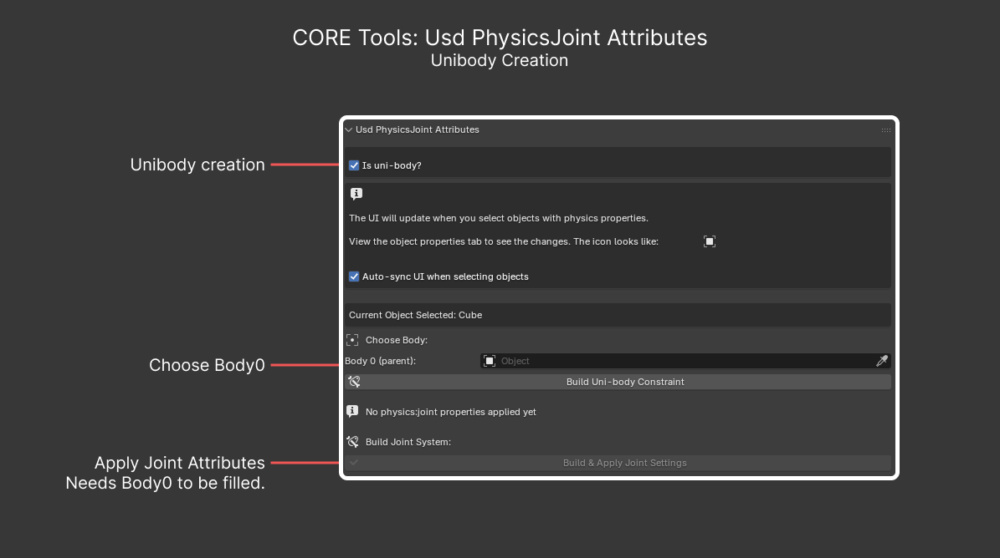

- `is uni-body?`: Will shift the UI for unibody creation.
- `Body 0 (parent)`: Choose the object/mesh.
- `Build Joint System`: Will build the correct collections and hierarchy, apply necessary pxr-schema properties and be prepared for export.

#### Revolute Joint Creation
Revolute Description: a joint that can rotate in 1 axis.  Examples of a revolute joint:  a door hinge, a lid of a container.


- `is uni-body?`: Keep this off for revolute joints (otherwise, the UI switches to uni-body creation).
- `Auto-sync UI when selecting objects`: usually best to leave this on.. if object has previously applied pxr attributes, then it will sync back to this interface.
- `Assign Joint Type`: Switch this to `Revoute (Hinge)` to have UI switch to revolute creation.
- `Body 0 (Parent)`: Choose the parent object of the joint. Example: for a door attached to a wall, select the wall as `Body 0` in most cases.
- `Body 1 (Child)`: Choose the child object of the joint. Example: for a door attached to a wall, select the door as `Body 1` in most cases.
- `Joint Axis`: This is the axis the joint will rotate on.  This will work on both the world axis and the local axis of the object.  **DO NOT** apply rotation transforms if you want the joint to rotate on it's local axis.
- `Infinite Limit`: Set this toggle if user knows the joint will rotate freely on select axis.  Example: a chair's caster... the caster or wheel can always rotate freely.
- `Limits`: User can set the lower and upper limits in degrees (not radians).  **NOTE:** Setting `Infinite Limit` will disable limits.  **NOTE 2:** The lower number is **ALWAYS** the lower limit... Example: the joint goes from 0 to -95... then `Lower Limit`: -95, `Upper Limit`: 0.
- `Break Strength`: presets for break strength of a joint. (**NOTE**: the presets are not scientifically measured, they were added for convenience, don't assume they are 100% accurate).
- `Angular Drive`: present for users to setup driven systems. (**NOTE**: this preset is still in development and won't always work.  Physics tuning is a tricky endevour so usually 1 preset won't match everything).
- `Build Joint System`: Will build the correct collections and hierarchy, apply necessary pxr-schema properties and be prepared for export.

#### Prismatic Joint Creation
Prismatic Joint Description: a joint that can slide in 1 axis.  Examples of a prismatic joint: a desk drawer.

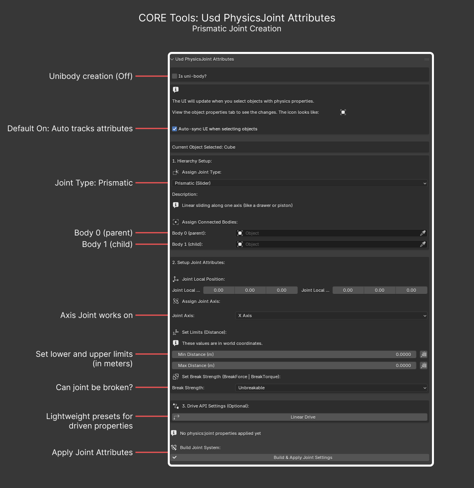

- `is uni-body?`: Keep this off for prismatic joints (otherwise, the UI switches to uni-body creation).
- `Auto-sync UI when selecting objects`: usually best to leave this on.. if object has previously applied pxr attributes, then it will sync back to this interface.
- `Assign Joint Type`: Switch this to `Prismatic (Slider)` to have UI switch to prismatic creation.
- `Body 0 (Parent)`: Choose the parent object of the joint. Example: for a door attached to a wall, select the wall as `Body 0` in most cases.
- `Body 1 (Child)`: Choose the child object of the joint. Example: for a door attached to a wall, select the door as `Body 1` in most cases.
- `Joint Axis`: This is the axis the joint will slide on.  **DO NOT** apply transforms in most cases.  The system is reading the world transforms of the object.
- `Limits`: User can set the lower and upper limits in meters.  Example: the joint goes from 0 to -0.2... then `Lower Limit`: -0.2, `Upper Limit`: 0.
- `Break Strength`: presets for break strength of a joint. (**NOTE**: the presets are not scientifically measured, they were added for convenience, don't assume they are 100% accurate).
- `Linear Drive`: present for users to setup driven systems. (**NOTE**: this preset is still in development and won't always work.  Physics tuning is a tricky endevour so usually 1 preset won't match everything).
- `Build Joint System`: Will build the correct collections and hierarchy, apply necessary pxr-schema properties and be prepared for export.

#### Fixed Joint Creation
Fixed Joint Description: a joint that is fixed and not moving.  Examples of a fixed joint: a shelf attached to an upright.

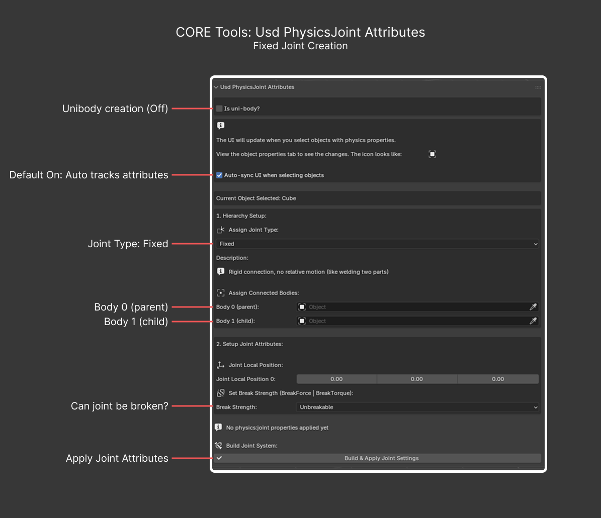

- `is uni-body?`: Keep this off for fixed joints (otherwise, the UI switches to uni-body creation).
- `Auto-sync UI when selecting objects`: usually best to leave this on.. if object has previously applied pxr attributes, then it will sync back to this interface.
- `Assign Joint Type`: Switch this to `Fixed` to have UI switch to prismatic creation.
- `Body 0 (Parent)`: Choose the parent object of the joint. Example: for a shelf attached to an upright, select the upright as `Body 0` in most cases.
- `Body 1 (Child)`: Choose the child object of the joint. Example: for a shelf attached to an upright, select the shelf as `Body 1` in most cases.
- `Break Strength`: presets for break strength of a joint. (**NOTE**: the presets are not scientifically measured, they were added for convenience, don't assume they are 100% accurate).
- `Build Joint System`: Will build the correct collections and hierarchy, apply necessary pxr-schema properties and be prepared for export.


### Grasp Setup
Also referred to as canonical grasp.  This system builds 2 points and asks users to move the points until the line between the points intersects the object that needs to be grasped.  By doing this, the user can prove to the system that this object can and should be grabbed from 1 place.  

**NOTE: only 1 grasp needs to be created**.

`SRCORE_PT_grasp_setup`: Author grasp pairs / spheres on a prop (used downstream by runtime tests).


To find out more about how to setup grasp points, reference:
<a href="https://github.com/NVIDIA/simready-blender-add-on/blob/main/Docs/faq_helpers/5_How_to_add_grasp_points.mp4" target="_blank" rel="noopener noreferrer">How to add grasp points</a>.


## Thumbnailer


`CORE_PT_Thumbnailer`: Load a standardized lighting rig and camera setup, then render single thumbnails or a turntable for the active asset. Operators:


- `core.load_lighting_rig`
- `core.auto_thumbnail`, `core.render_thumbnail`, `core.render_turntable`
- `core.select_light_prim`, `core.toggle_safe_areas`, `core.reset_thumbnail_camera`


This replaces the older standalone **Lighting** panel; the legacy `pt_lighting.py` is no longer registered in the add-on.


### Asset Profiles


`CORE_PT_Asset_Profiles_Validation`: Pick a SimReady asset profile from a dropdown menu (for example, a specific feature/requirement set). Validation against profiles is a work-in-progress; the apply operator (`core.apply_profile`) is currently a stub for future profile-driven validation.


## SimReady Checklist


`CORE_PT_ArtistChecklist`: Open a step-by-step authoring checklist dialog to confirm you have completed the SimReady setup steps for an asset (such as for metadata, materials, and collisions). Operators: `core.artist_checklist_launch`, `core.artist_checklist_reset`, `core.artist_checklist_mark_all`, `core.artist_checklist_tip`.


## SimReady Blender Core - Logs


`CORE_VIEW3D_PT_AddonHelpPanel`: Gain quick access to the add-on's log files. This is useful when reporting issues. Operators:


- **Open Logs Folder**: `core.open_logs_folder`: Open the logs folder in your file manager.
- **Copy Latest Log Path**: `core.dst_copy_latest_log`: Copy the latest log file to a destination of your choice.


## Preflight & Export


`CORE_PT_Export`: Automatically check mesh, material, and hierarchy in the Blender scene, provide auto-fixes for the problems it can repair, and descriptions for problems it can’t repair.  There are two error types: **Error** and **Warning**. An **Error** blocks export. Blender raises a **Warning** if it detects a condition that might be a problem, but does not block export.


Click **Run Validation(s)** to launch the Qt-based validation UI.


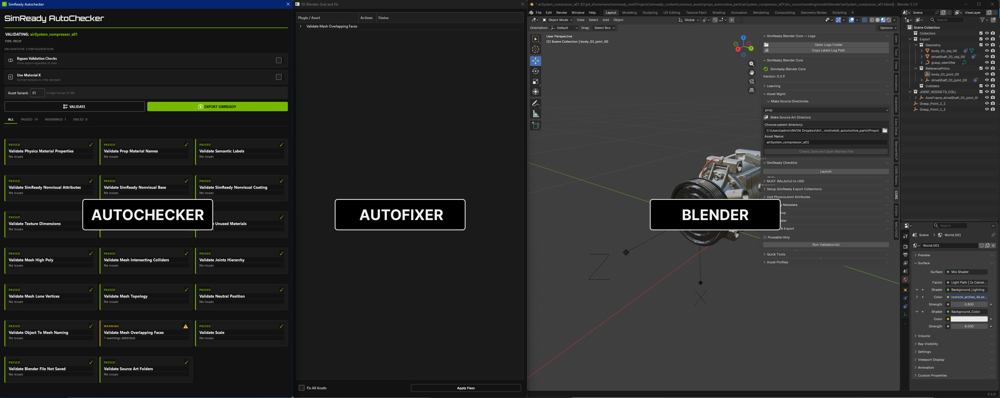


Click **VALIDATE** to start the checks.


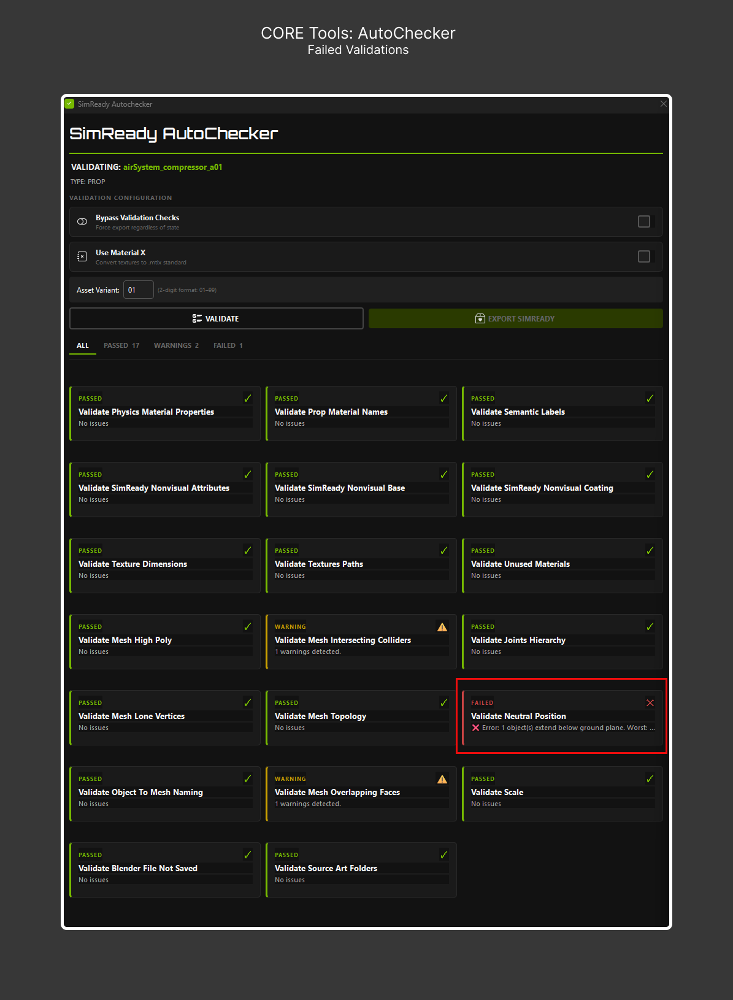


If you see failed checks, click on the failed card to open the inspector / auto-fixer.

Press **Autofix** to try and repair the errors.


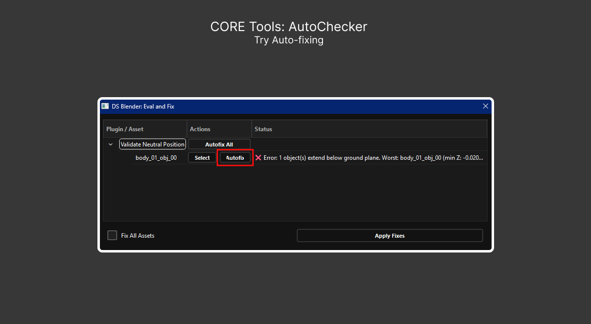


Re-run **VALIDATE** again to see if the errors have cleared.  Once errors are cleared, the *EXPORT SIMREADY** button turns green. Warnings do not block export (only errors).


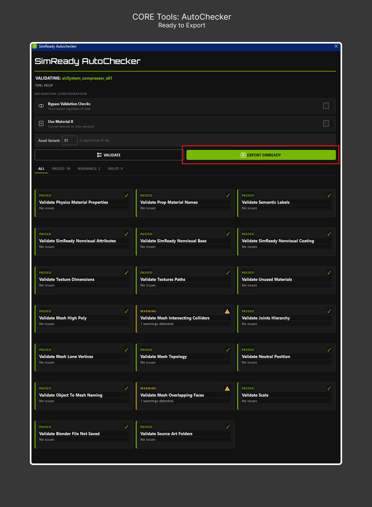


A successful export produces a `/simready_usd` folder containing the asset, ready for pre-CIP validation and ingestion.


## Properties Editor Panels


The following panels are not in the CORE **N-panel**; they are located in the **Properties** editor where they make contextual sense.


### Object → Wikidata Metadata


> **Warning:** Wikidata search requires an Internet connection.


`WD_PT_object_panel`: Search Wikidata and apply a Wikidata QID to the selected object as a SimReady semantic label. This is important for downstream ML (machine learning) segmentation.


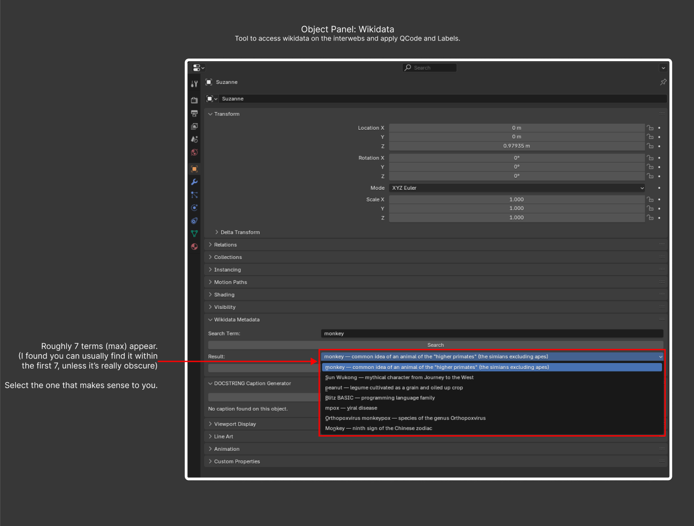


**Tip 1:** After applying the QID, you can also edit the field manually or run another search.


**Tip 2:** Applied Wikidata is also visible in the **N-panel → Item → Custom Properties**.


### Object Data → Wikidata Metadata


`WD_PT_data_panel`: Review the data the Wikidata API has applied to the object and its mesh data, and remove it if you are not satisfied with it.


### Material → SimReady Non-Visual Settings


`MATERIAL_PT_simready_nonvisual`: Non-visual sensor attributes used by the <a href="https://docs.omniverse.nvidia.com/materials-and-rendering/latest/rtx-renderer.html" target="_blank" rel="noopener noreferrer">RTX renderer</a> to model how a material reads to non-visual sensors (such as radar, lidar, or IR). It allows you to manage Base, Coating, and Attributes; for example, base == “aluminum”, coating = “painted”, attributes = “emissive, visually-transparent, single-sided”.


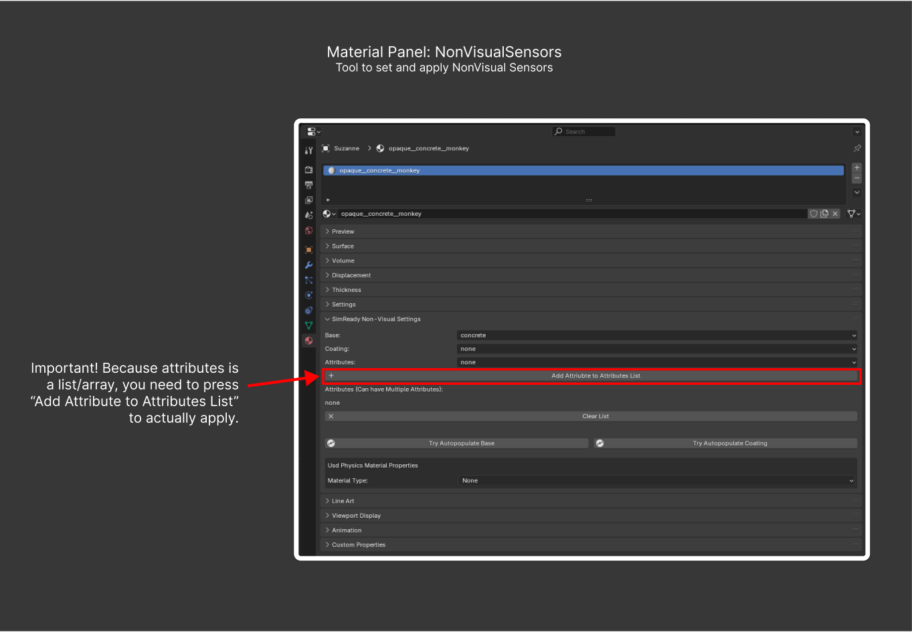
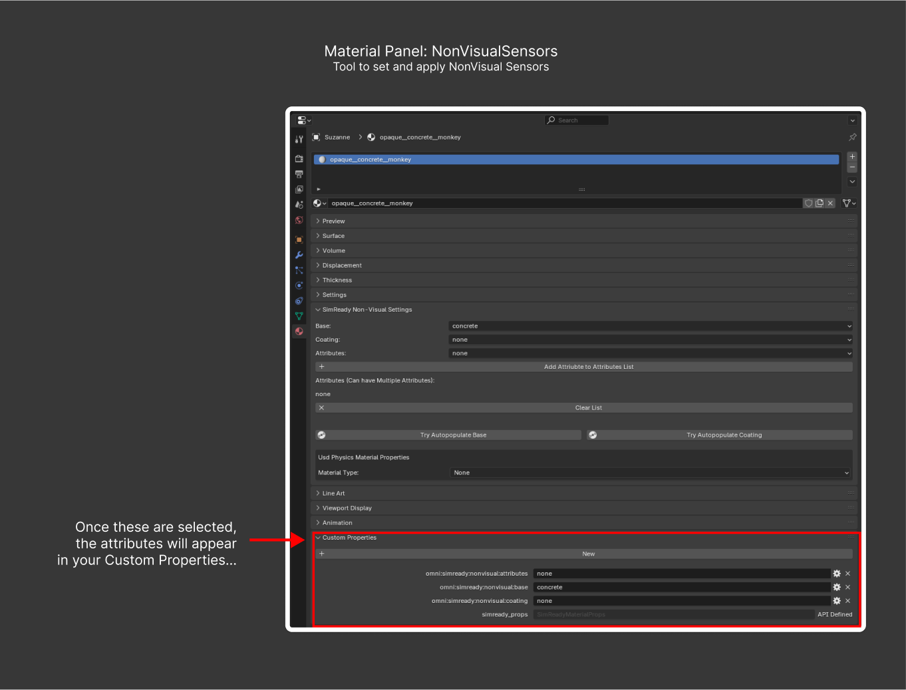


The panel also exposes **Assign Usd Physics Properties** / **Update Usd Physics Properties** so a JSON sidecar of PhysX material properties can be attached to each material:


- `simready.add_enum_to_list`, `simready.clear_enum_list`
- `simready.autopop_base`, `simready.autopop_coating`
- `simready.assign_physx_properties`, `simready.update_physx_properties`


### Object → Dense Captions


Dense Captions are detailed human-readable descriptions of an asset that are used for scene understanding (for example, "A red, two-door sports car with a tan leather interior and chrome rims"). The add-on allows the user to type in the description of the object. 


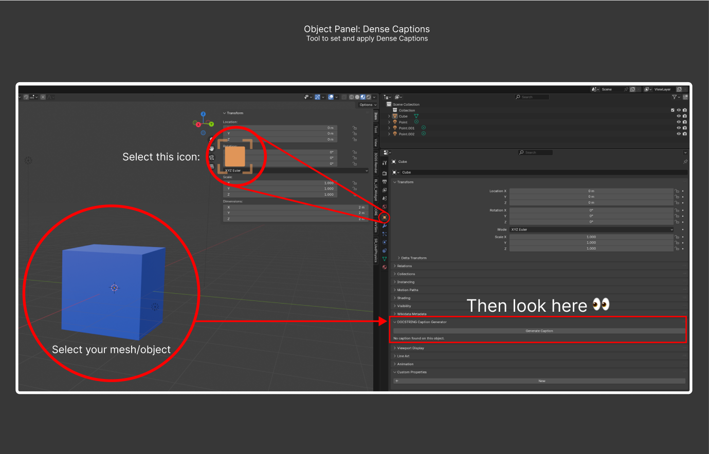
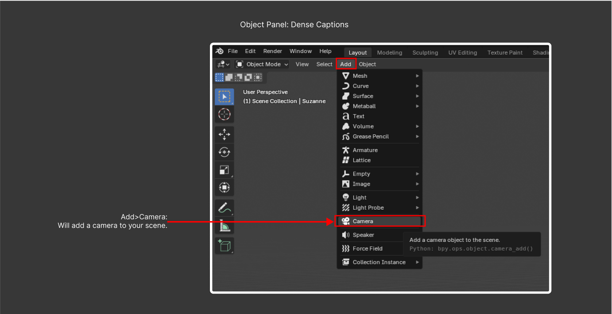
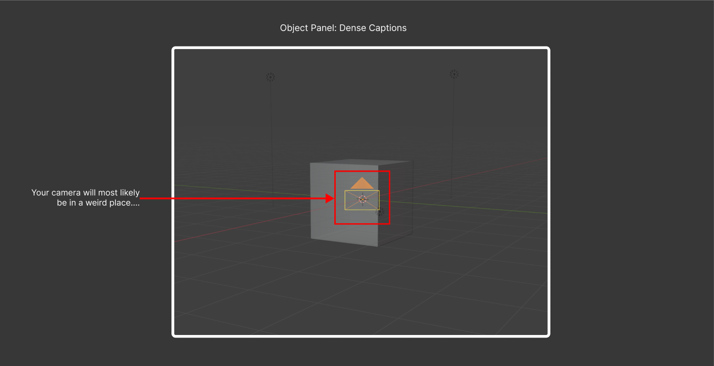

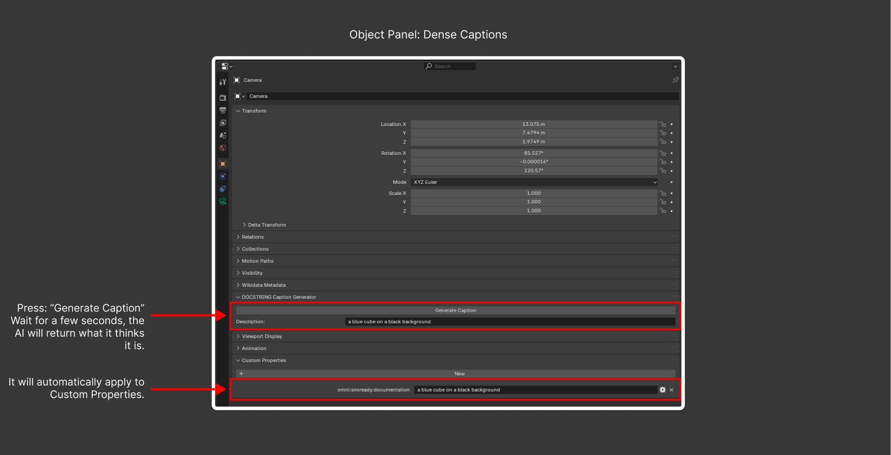


**Optional**: Users can enable the BLIP AI model to setup the dense captions for them, however the AI-generated caption is a starting point; add detail and correct mistakes.


### Materials Naming


The dedicated **Materials Naming** panel is now under **Quick Tools → Create Material Names** (refer to [Child Sub-panels](#child-sub-panels)). Earlier screenshots are included here for reference.


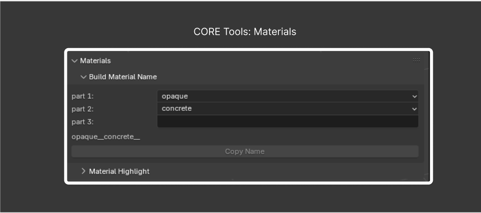


## File Menu Integrations


- **File → Export → SimReady USD (.usd)**: `export_scene.simready_usd`. Same export pipeline used by **Preflight & Export**.
- **File → Import → Import SimReady USD**: `simready.import_usd`.
- **File → Import → MJCF (MuJoCo) (.xml)**: `sr_core.import_mjcf_with_converter`.


## USD Hook


`SimReady_USDHook` (registered as a `bpy.types.USDHook`) participates in Blender's USD import/export pipeline behind the scenes. There is no UI panel; it runs automatically when Blender does USD I/O.


## Appendix — Troubleshooting


## TROUBLESHOOTING: Why does autochecker keep flagging my textures as in the wrong location?


**Answer 1:** The purpose of the check is to **normalize** where source textures are stored. For example, Artist A might be loading textures from their Downloads folder, or Artist B might be saving from Substance Painter into a working directory and forgetting to move them. The check tries to remap and copy textures into `/Texture` (and re-link the material on success).


This is designed to enforce **relative** texture paths to prevent failures in downstream runtimes.


## TROUBLESHOOTING: Why does autochecker keep flagging my textures as too large?


**Answer 1:** The current cap is **4096x4096**. Standards can be revisited; if this cap is too restrictive, file an issue.


## TROUBLESHOOTING: Why does autochecker keep flagging my texture dimensions as wrong?


**Answer 1:** This check is enforcing **power-of-two** texture sizes (128, 256, 512, 1024, 2048). This is done for two reasons:


- Cleanliness: a 127×128 texture is almost always a tired-artist accident.
- Compressed formats like `.dds` (GPU compression) error on non-power-of-two sizes such as 227×256.


## TROUBLESHOOTING: Why is the autochecker not finding my asset type?


**Answer 1:** Asset class is inferred from the on-disk **folder structure**. If your asset is stored outside the standard structure, the SimReady Autochecker cannot classify it. This is why the **Asset Mgmt → Make Source Directories** flow is recommended.


## TROUBLESHOOTING: Why does my material come out pink after auto-fixing textures?


**Answer 1:** A pink material means the texture file does not exist on your system. The most common cause is an artist publishing work with absolute paths. For example:


- Artist A publishes work with absolute paths to their harddrive.
- Artist B picks up the work (from a shared disk) but cannot resolve those absolute paths.


Paths are no longer on a shared drive; be mindful when publishing.


**Answer 2:** Blender supports **Packed Textures** (textures embedded into the `.blend`). The add-on handles this case but corner-cases still slip through. If you hit one, **unpack** the textures and continue.


