# SimReady Blender CORE Add-on Artist Tools Reference Guide

## Table of Contents

- [Introduction](#introduction)
- [Prerequisites](#prerequisites)
- [Installation](#installation)
   - [Download or Build Local Copy of Blender Add-on](#download-or-build-local-copy-of-blender-add-on)
   - [Install the Blender Add-on](#install-the-blender-add-on)
   - [Set Up Your Project Configuration](#set-up-your-project-configuration)
- [Where to Find the Panels](#where-to-find-the-panels)
- [Blender CORE Add-on N-Panel](#blender-core-add-on-n-panel)
   - [Main / Version](#main-version)
   - [Learning](#learning)
   - [Asset Mgmt](#asset-mgmt)
   - [Quick Tools](#quick-tools)
   - [SimReady Metadata](#simready-metadata)
   - [MJCF (MuJoCo) to USD](#mjcf-mujoco-to-usd)
   - [Set Up SimReady Export Collections](#set-up-simready-export-collections)
   - [USD Physics Joint Attributes](#usd-physics-joint-attributes)
   - [Grasp Setup](#grasp-setup)
   - [Thumbnailer](#thumbnailer)
   - [Asset Profiles](#asset-profiles)
   - [SimReady Checklist](#simready-checklist)
   - [SimReady Blender CORE Logs](#simready-blender-core-logs)
   - [Preflight and Export](#preflight-and-export)
- [Properties Editor Panels](#properties-editor-panels)
   - [Object > Wikidata Metadata](#object-wikidata-metadata)
   - [Object Data > Wikidata Metadata](#object-data-wikidata-metadata)
   - [Material > SimReady Non-Visual Settings](#material-simready-non-visual-settings)
   - [Object > Dense Captions](#object-dense-captions)
   - [Materials Naming](#materials-naming)
- [File Menu Integrations](#file-menu-integrations)
- [USD Hook](#usd-hook)
- [Troubleshooting](#troubleshooting)

## Introduction

This is the SimReady Blender CORE Add-on. Use it to set up, validate, and export SimReady-neutral USD assets, and capitalize on a growing set of authoring panels for SimReady metadata, physics joints, MuJoCo (MJCF) import, vehicle attributes, thumbnail rendering, and more, as they become available. It is under active development and updated regularly. This document describes the Blender add-on's high-level capabilities, and is intended for Content Creators experienced in Blender.

## Prerequisites

### Requirements

   - Windows 10 or Windows 11 (tested on Windows 11)
   - SimReady Foundation and dependencies (latest version), installed per the <a href="https://github.com/NVIDIA/simready-foundation/blob/main/README.md" target="_blank" rel="noopener noreferrer">README</a>
   - Blender 5.0 or later (5.1 recommended; refer to <a href="https://www.blender.org/download/" target="_blank" rel="noopener noreferrer">Blender Downloads</a>)
   - Python 3.12 
      - Note: this is for SimReady Foundations, not Blender.  Blender is bundled with it's own verison of Python.
   - Git and Git LFS

   Additional references:

   - <a href="https://nvidia.github.io/simready-foundation/guides/getting_started.html" target="_blank" rel="noopener noreferrer">SimReady Getting Started guide</a>
   - <a href="https://nvidia.github.io/simready-foundation/index.html" target="_blank" rel="noopener noreferrer">SimReady Foundation - Content Guidelines and Requirements</a>

### Internet Connection

An internet connection is required on first launch and for each add-on upgrade, to install Python dependencies (PySide6, Pillow, PyTorch, Transformers, Markdown, and others), and to allow the Wikidata search panel to reach the Wikidata API.

After initial setup and upgrades, an internet connection is required only to access AWS asset libraries.

## Installation


At a high level, you take this sequence of actions to install the Blender add-on:


1. [Download or build a local copy of the Blender add-on](#download-or-build-local-copy-of-blender-add-on).
2. [Install the add-on](#install-the-blender-add-on).
3. [Configure the add-on for your project](#set-up-your-project-configuration).


### Download or Build Local Copy of Blender Add-on


The SimReady Blender Add-on is built and distributed as a single `.zip` file from the Blender add-on repository. How you acquire or build a copy of the add-on depends on whether you are using the standard version, or extending a version for your own use.


#### To Use Pre-Built Add-on


To use the pre-built version of the Blender add-on, download the add-on zip file.


1. In a browser, go to the <a href="https://github.com/NVIDIA/simready-blender-add-on/releases/tag/Latest" target="_blank" rel="noopener noreferrer">SimReady Blender Add-on release</a>.
2. Download **SimReady_Blender_CORE@2026.4.0.zip**.
3. By default, the download goes to "C:\<User>\Downloads"; you do not need to move it.

#### To Build Custom Add-on

To create a custom version of the add-on for your own use, fork the main branch of the Blender add-on repository and clone the fork. Make your changes to your copy of the source, then build a local add-on zip file as follows.

In a browser, go to the <a href="https://github.com/NVIDIA/simready-blender-add-on" target="_blank" rel="noopener noreferrer">NVIDIA/simready-blender-add-on GitHub repository</a>.

1. Fork the main branch of the repository for your work (first time only).
2. Clone the forked copy of the repository:

   ```bash
   cd <repo_container_directory>
   git clone <forked copy>
   ```

3. Update Blender add-on source files as appropriate.
4. Build the Blender add-on zip:

   ```bash
   python CORE_SysUtils/package/make_core_zip.py
   ```

The Python script creates `SimReady_Blender_CORE@<version>.zip` (for example, `SimReady_Blender_CORE@2026.4.0.zip`) at the repository root. The zip file contains both `CORE_ArtistTools/` and `CORE_ArtistTools_Resources/`, which together provide the essential operations, functions, and supporting resources that form the foundation of Blender's interface and workflow.

### Install the Blender Add-on

Open Blender's add-on preferences:

1. Open the Blender app, and go to **Edit > Preferences > Add-ons**.

   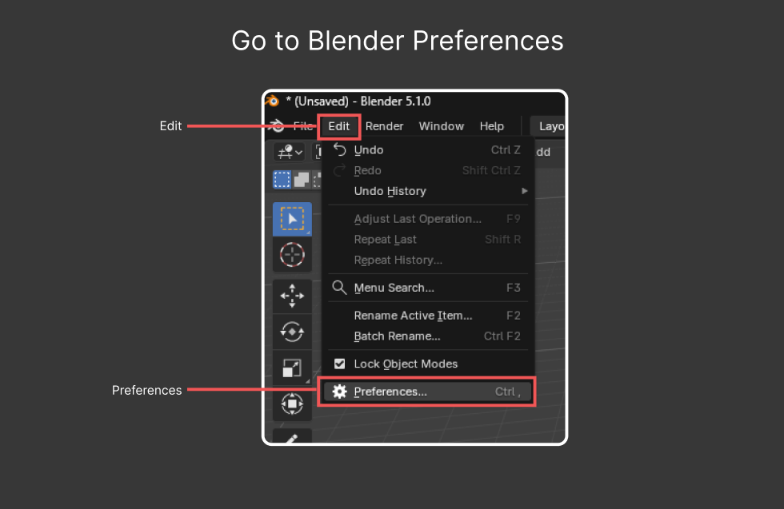{w=800px}

2. Remove any earlier version of the Blender CORE Add-on, if installed.

   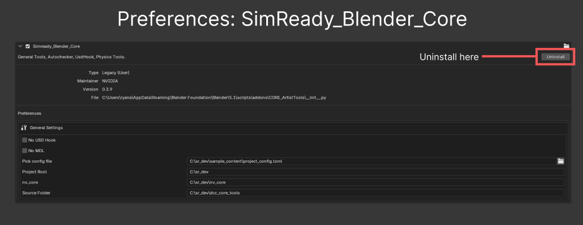{w=800px}

3. Install the latest version of the add-on.

   1. In Blender, go to **Edit > Preferences**.

   {w=800px}

   2. Click **Add-ons** in the navigation panel on the left side of the window.

   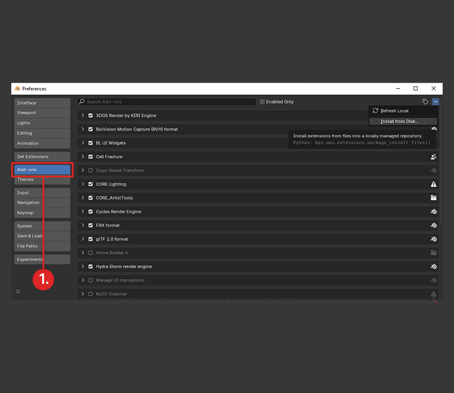{w=800px}

   3. Click the down-arrow on the top right side of the window to open a dropdown menu.

   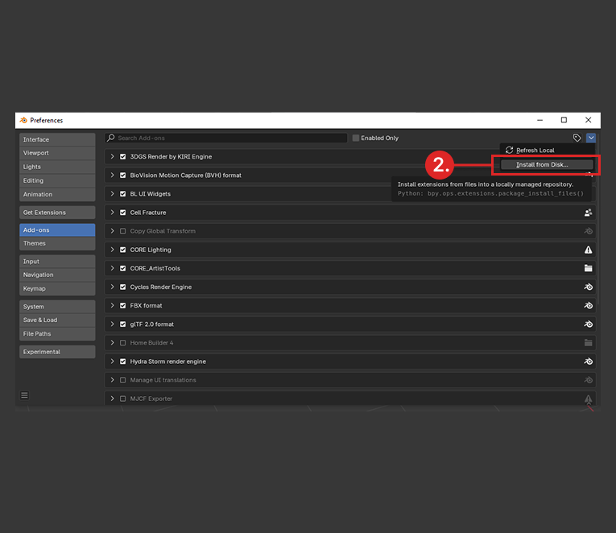{w=800px}

   4. Click **Install from Disk…** in the menu.

   5. Select the `SimReady_Blender_CORE_<version>.zip` file you downloaded or built earlier.

   6. Click the **Install from Disk** button on the bottom of the window.

   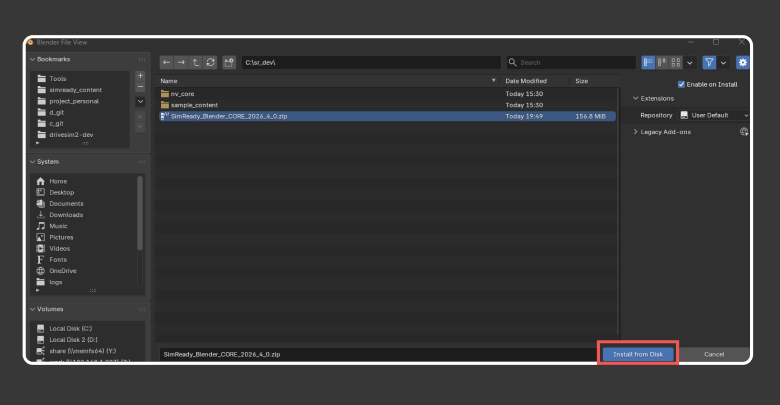{w=800px}

   7. Wait for the installation to complete. This can take several minutes, depending on connection speeds, during which Blender does not report any installation progress. If it does not finish within five minutes, **restart Blender**.

4. Enable the Blender CORE Add-on. **Note:** This might not be necessary. Blender usually auto-enables it.

   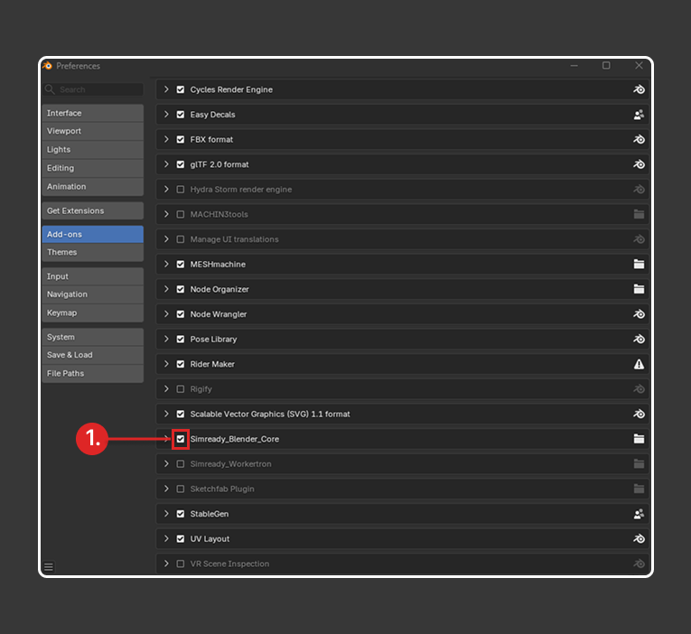{w=800px}

5. **Restart Blender**.

> **Important:** Always restart Blender after installing the SimReady Blender CORE Add-on, both the first time and after every upgrade. The SimReady Blender CORE Add-on does not refresh while a Blender session is active.

### Set Up Your Project Configuration

To connect the Blender add-on to the SimReady Foundation, follow these steps to update the `project_config.toml` file included with the SimReady Foundation:

1. In Blender, go to **Edit > Preferences**.

   {w=800px}

2. Select **Add-ons** in the left side of the **Preferences** window.

   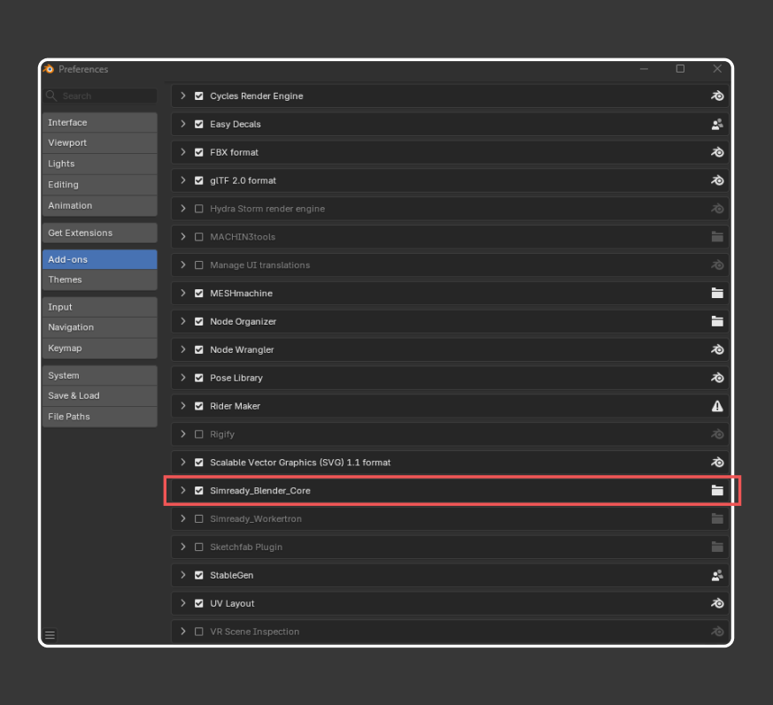{w=800px}

3. Find the **SimReady_Blender_Core** Add-on, and click the dropdown arrow (`>`) to expand the **SimReady_Blender_Core** preferences.

   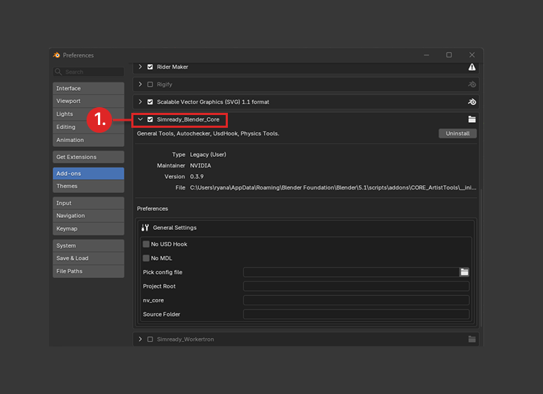{w=800px}

4. Use the folder icon (inside a red rectangle) in **General Settings** to open a **file picker**, and navigate to the `project_config.toml` file located in `<foundations>\sample_content\project_config.toml`.

   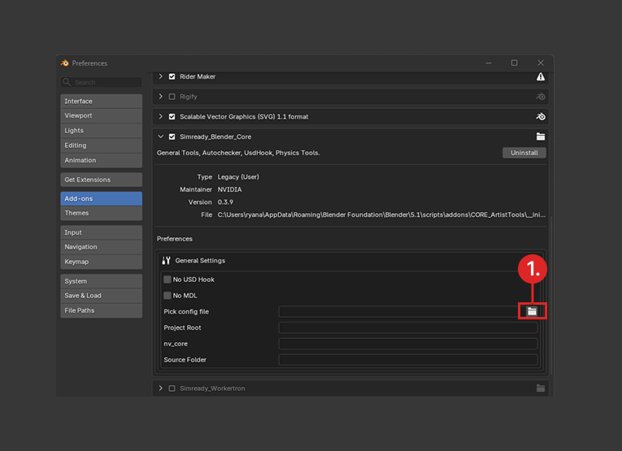{w=800px}

5. Select `project_config.toml` and click **Accept**.

   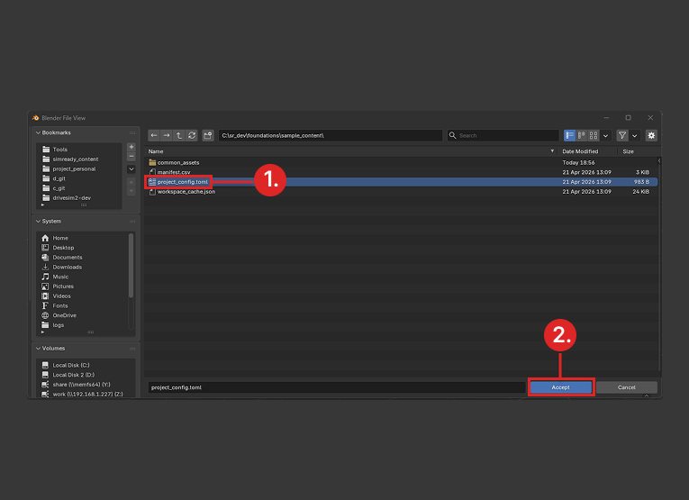{w=800px}

All file paths (**Pick config file**, **Project Root**, **nv_core**, and **Source Folder**) should now correctly point to the necessary folders for the add-on to function. If any of these folders remain empty, go back to step 5, re-select `project_config.toml`, and click **Accept**.

   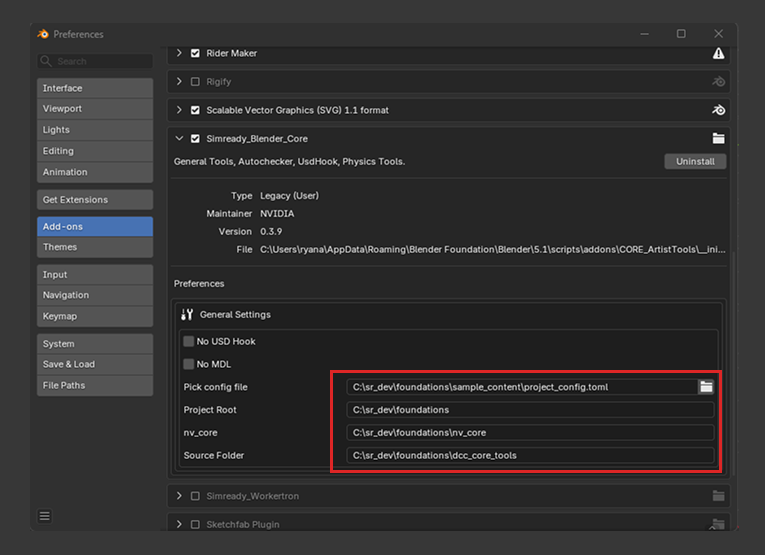{w=800px}

### Where to Find the Panels

The Blender add-on installs user interface elements in several places, not just the Blender CORE **N-panel**. Here is a quick map:

| Location | Contents |
|---|---|
| **3D View > N-panel > CORE tab** | Main, Learning, Asset Mgmt, Quick Tools, SimReady Metadata, MJCF, Export Collections, Joint Attributes, Grasp Setup, Thumbnailer, Asset Profiles, Checklist, Logs, Preflight and Export |
| **Properties > Object** | Wikidata Metadata, Dense Captions |
| **Properties > Object Data (mesh)** | Wikidata Metadata (read/remove view) |
| **Properties > Material** | SimReady Non-Visual Settings |
| **File > Export** | SimReady USD (`.usd`) |
| **File > Import** | SimReady USD, MJCF (MuJoCo) (`.xml`) |
| **Background** | `SimReady_USDHook` participates in USD I/O |

> **Note:** Refer to [Blender CORE Add-on N-Panel](#blender-core-add-on-n-panel) for details about the N-panel.

### Troubleshooting Add-on Installation Issues

When first installing the SimReady Blender add-ons, Blender might prompt you to restart, because the install scripts run during initialization. You might also see an exception due to internet speed, timing, or Python cache generation.

If `pip`* is still generating the cache when initialization finishes, you might see a warning to restart Blender. After restarting, the add-on should initialize correctly.

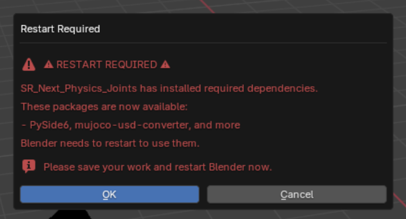{w=800px}

As noted earlier, restart Blender after installing the SimReady Blender CORE Add-on.

> *`pip` is Python's package installer, usually from <a href="https://pypi.org/" target="_blank" rel="noopener noreferrer">PyPI</a>.

## Blender CORE Add-on N-Panel

This panel is located in Blender's **N-panel** under the **CORE** tab.

> **Tip:** The hotkey in Blender is N. Be sure your mouse hovers over the viewport before pressing N.

{w=800px}

The **CORE** tab contains the following panels.

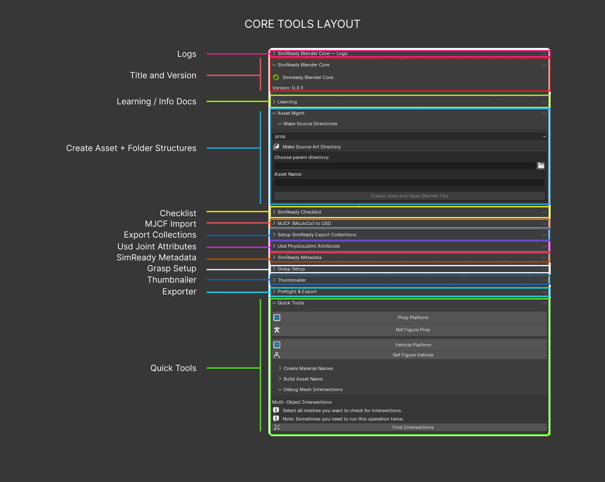{w=800px}

### Main / Version
`CORE_PT_main_panel`: Header panel that displays the **add-on name** and **version**.

{w=800px}

> **Note:** `CORE_PT_main_panel` refers to the class names within the add-on. This can be a useful reference for developers.

### Learning
`CORE_PT_Documentation`: Opens this reference guide in your default browser from the Blender interface.

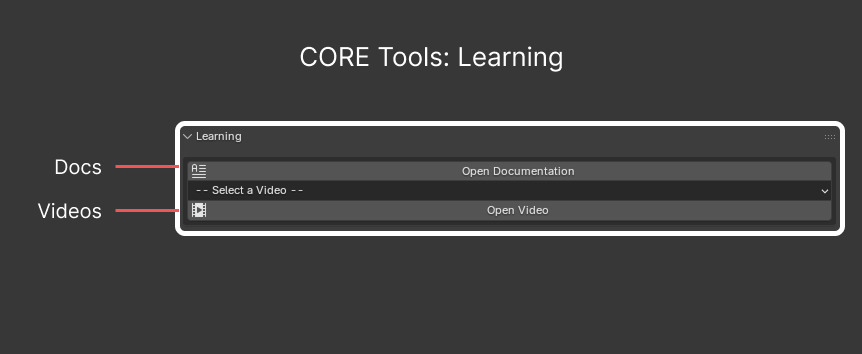{w=800px}

> Note: The video section is created for the internal NVIDIA team and cannot be used by outside teams. As an alternative, video guides are available in the [`docs/faq_helpers`](https://github.com/NVIDIA/simready-blender-add-on/tree/main/docs/faq_helpers) folder of the repository. Because GitHub does not play .mp4 files inline, you must download each video to view it. To watch a video, open its link in the following table, click **Download raw file** on the GitHub page, and play the downloaded file locally

| # | Title | Video |
|---|-------|-------|
| 1 | How to install the CORE tool add-on | [1_How_to_install_core_tool_addon.mp4](https://github.com/NVIDIA/simready-blender-add-on/blob/main/docs/faq_helpers/1_How_to_install_core_tool_addon.mp4) |
| 2 | How to access CORE tool log files | [2_How_to_access_core_tool_log_files.mp4](https://github.com/NVIDIA/simready-blender-add-on/blob/main/docs/faq_helpers/2_How_to_access_core_tool_log_files.mp4) |
| 3 | How to create SimReady collections | [3_How_to_create_Sim_Ready_Collections.mp4](https://github.com/NVIDIA/simready-blender-add-on/blob/main/docs/faq_helpers/3_How_to_create_Sim_Ready_Collections.mp4) |
| 4 | How to import MJCF assets | [4_How_to_import_MJCF_assets.mp4](https://github.com/NVIDIA/simready-blender-add-on/blob/main/docs/faq_helpers/4_How_to_import_MJFC_assets.mp4) |
| 5 | How to add grasp points | [5_How_to_add_grasp_points.mp4](https://github.com/NVIDIA/simready-blender-add-on/blob/main/docs/faq_helpers/5_How_to_add_grasp_points.mp4) |
| 6 | How to create uni-body joints | [6_How_to_create_uni_body_joints.mp4](https://github.com/NVIDIA/simready-blender-add-on/blob/main/docs/faq_helpers/6_How_to_create_uni_body_joints.mp4) |
| 7 | How to set up fixed joints | [7_How_to_setup_fixed_joints.mp4](https://github.com/NVIDIA/simready-blender-add-on/blob/main/docs/faq_helpers/7_How_to_setup_fixed_joints.mp4) |
| 8 | How to set up revolute (hinge) joints | [8_How_to_setup_revolute_joints.mp4](https://github.com/NVIDIA/simready-blender-add-on/blob/main/docs/faq_helpers/8_How_to_setup_revolute_joints.mp4) |
| 9 | How to set up prismatic joints | [9_How_to_setup_prismatic_joints.mp4](https://github.com/NVIDIA/simready-blender-add-on/blob/main/docs/faq_helpers/9_How_to_setup_prismatic_joints.mp4) |
| 10 | How to create folder structure automatically | [10_How_to_create_folder_structure_automatically.mp4](https://github.com/NVIDIA/simready-blender-add-on/blob/main/docs/faq_helpers/10_How_to_create_folder_structure_automatically.mp4) |
| 11 | How to find intersecting geometry | [11_How_to_find_intersecting_geometry.mp4](https://github.com/NVIDIA/simready-blender-add-on/blob/main/docs/faq_helpers/11_How_to_find_intersecting_geometry.mp4) |

### Asset Mgmt
`CORE_PT_Asset`: Sets up the on-disk folder structure for a new asset and saves the asset file in the correct location. Follow this structure because many tools depend on it.

{w=800px}

#### Asset Classification Dropdown
This dropdown menu is currently focused on **Props**. It also exposes legacy DriveSim classes (Vehicles), but **Props** is the default and the only classification under active development for SimReady.

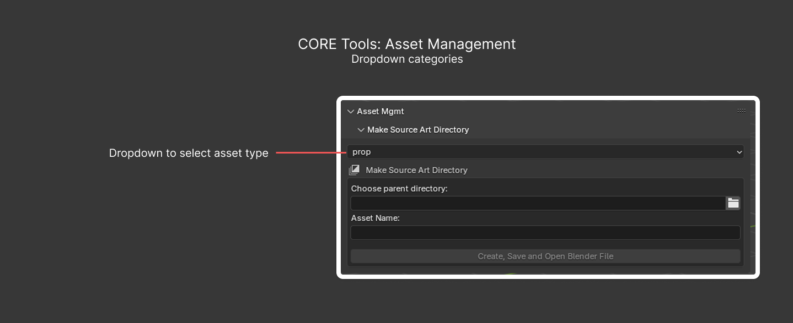{w=800px}

#### Make Source Directories

`CORE_PT_make_source_dir`: Child of the Asset Management (Asset Mgmt) panel. Pick a location for the prop, then create the folders and save the asset file in one click.

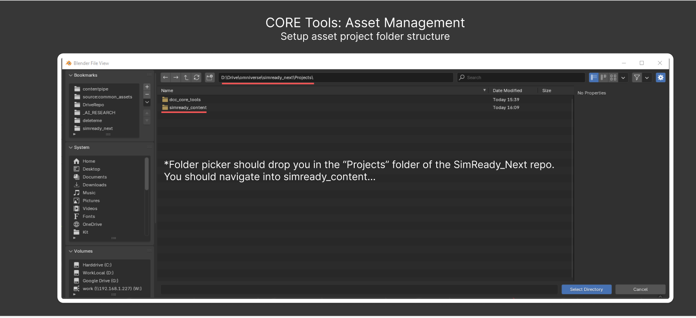{w=800px}
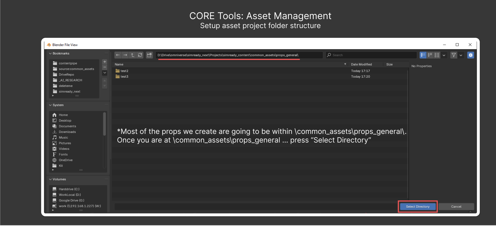{w=800px}
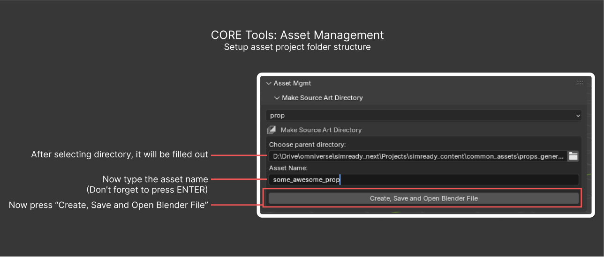{w=800px}

The following image shows the resulting folder structure.

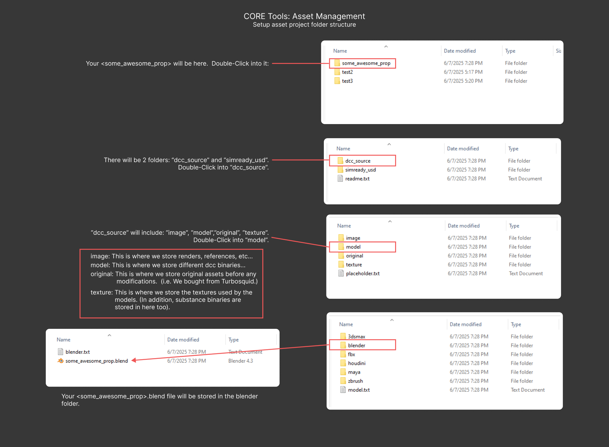{w=800px}

### Quick Tools

`CORE_PT_Tools`: Small utilities and helpers for asset setup.

{w=800px}

#### Prop Platform

A simple orientation widget. Assets can be authored from any direction: NVIDIA Omniverse uses a Z-up, X-forward orientation, but Blender often pushes you toward Y-forward. Use this widget as a reference for the asset's orientation.

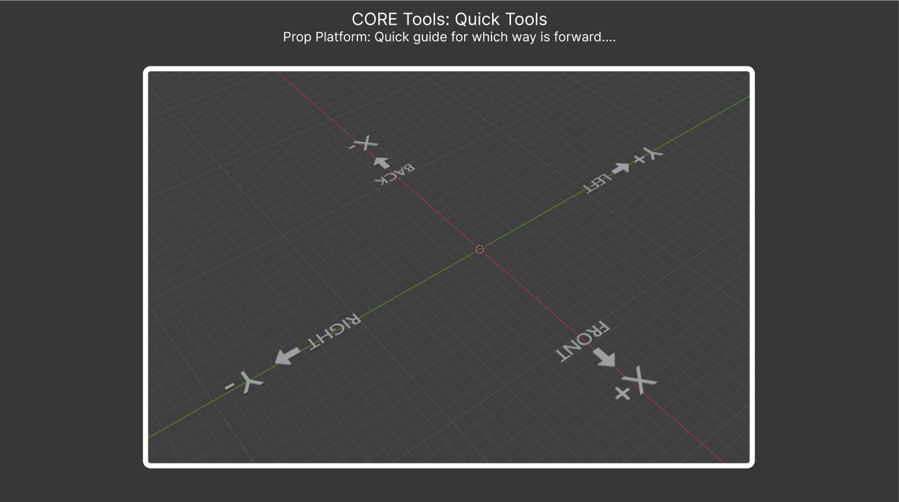{w=800px}

#### Ref Figure Prop

A standard human figure (6 ft. / 1.83 m) for scale reference.

{w=800px}

#### Child Sub-panels

- **Create Material Names** (`CORE_PT_Build_Mat_Name`): Assemble a standardized material name and copy it to the clipboard.
- **Build Asset Name** (`CORE_PT_Build_Asset_Name`): Assemble a standardized asset name and copy it to the clipboard.
- **Debug Mesh Intersections** (`SRVIZ_PT_intersections_panel`): Run `sr_viz.find_intersections_multi` to highlight meshes that interpenetrate.

### SimReady Metadata

`CORE_SIMREADY_PT_top_panel`: A central place to attach SimReady metadata at the asset (root) level. The panel combines a Wikidata search, global metadata fields, and a global *dense caption* generator. Per-object metadata still lives in the [Properties Editor Panels](#properties-editor-panels) section.

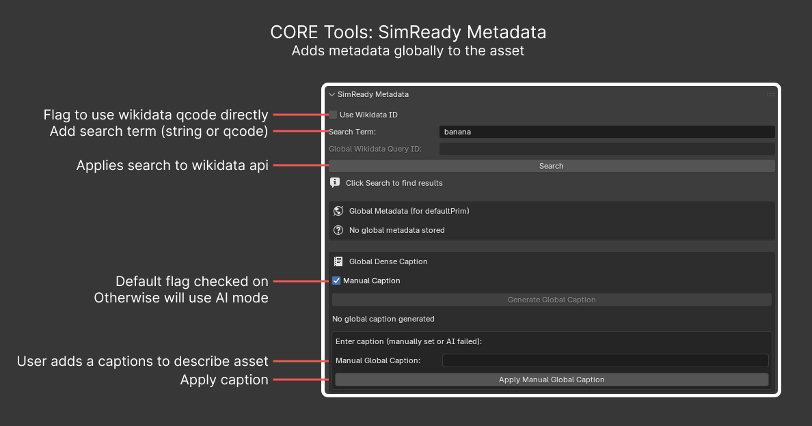{w=800px}

#### Wikidata
To read more about Wikidata, refer to the <a href="https://www.wikidata.org/wiki/Wikidata:Main_Page" target="_blank" rel="noopener noreferrer">Wikidata main page</a>. When you search for a term such as `banana`, the API returns a URL such as <a href="https://www.wikidata.org/wiki/Q503" target="_blank" rel="noopener noreferrer">https://www.wikidata.org/wiki/Q503</a>. In this interface, you can use either the term (`banana`) or the QID (`Q503`).

> **Note:** Retain the `Q` at the beginning of the QID to identify it as a Q identifier.

#### Dense Captions
Dense captions are descriptions that you tag your asset with to help large language models (LLMs) and vision language models (VLMs) understand what the asset is. A dense caption can be as long or short as you want.

### MJCF (MuJoCo) to USD

`SRCORE_PT_mjcf_import`: Convert MuJoCo `.xml` (MJCF) descriptions into USD. Operators:

- `sr_core.import_mjcf_with_converter`: Run the importer.
- `sr_core.export_mjcf`: Write MJCF back out.
- `sr_core.repair_mujoco_converter`: Re-install the bundled MuJoCo converter dependencies if they get corrupted.

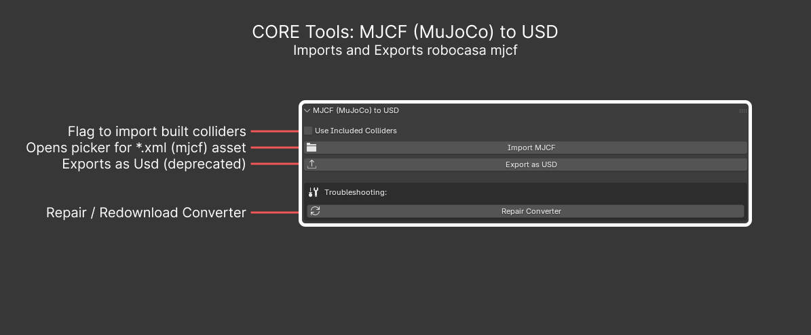{w=800px}

#### Use Included Colliders
Finds any MuJoCo meshes named `colliders` and imports them into Blender.

#### Import MJCF
Opens a Blender file picker where you can select an `.xml` file to import.
> **Note:** The MJCF importer is also accessible from **File > Import > MJCF (MuJoCo) (.xml)**.

#### Export as USD (deprecated)
Opens a file picker dialog that asks where to export your converted MJCF asset.
> **Note:** Use **File > Export > SimReady USD (.usd)** instead.

#### Repair Converter
Searches local Python `site-packages` to check whether the USD Exchange libraries are corrupted or missing, and re-triggers the download if needed.

### Set Up SimReady Export Collections

`SRCORE_PT_simready_panel`: Use one-click creation of the named Blender Collections (`Export`, `Geometry`, `ReferencePrims`, and `Colliders`) that the SimReady USD exporter expects. Operator: `sr_core.create_simready_collections`.

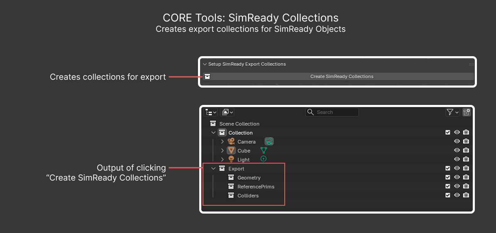{w=800px}

#### Collections

The required collection hierarchy is:
- Export (top collection group)
   - Geometry
   - ReferencePrims
   - Colliders

The exporter searches only within these collection groups.
> **Note:** You are not required to manually create these collections if you are using the USD Physics Joint menu. The add-on creates these collections automatically as you create joints or uni-body assets. This button serves as a helper and convenience.

### USD Physics Joint Attributes

`SRCORE_PT_joint_attributes`: Author USD Physics joint attributes on empties or constraints, including drive presets, position sync helpers, and prismatic min/max calculation. This panel can create uni-body assets and three multi-body variants (prismatic, revolute, and fixed), which are the most tested and most used types. It can also apply other types such as distance and spherical, but this guide does not document them.

> **Note:** For developer documentation on USD Joints, refer to the <a href="https://openusd.org/release/api/class_usd_physics_joint.html" target="_blank" rel="noopener noreferrer">UsdPhysicsJoint API reference</a>.

#### Overview
The following image shows the entire USD Physics Joint Attributes panel. Subsequent sections describe each joint type and button.
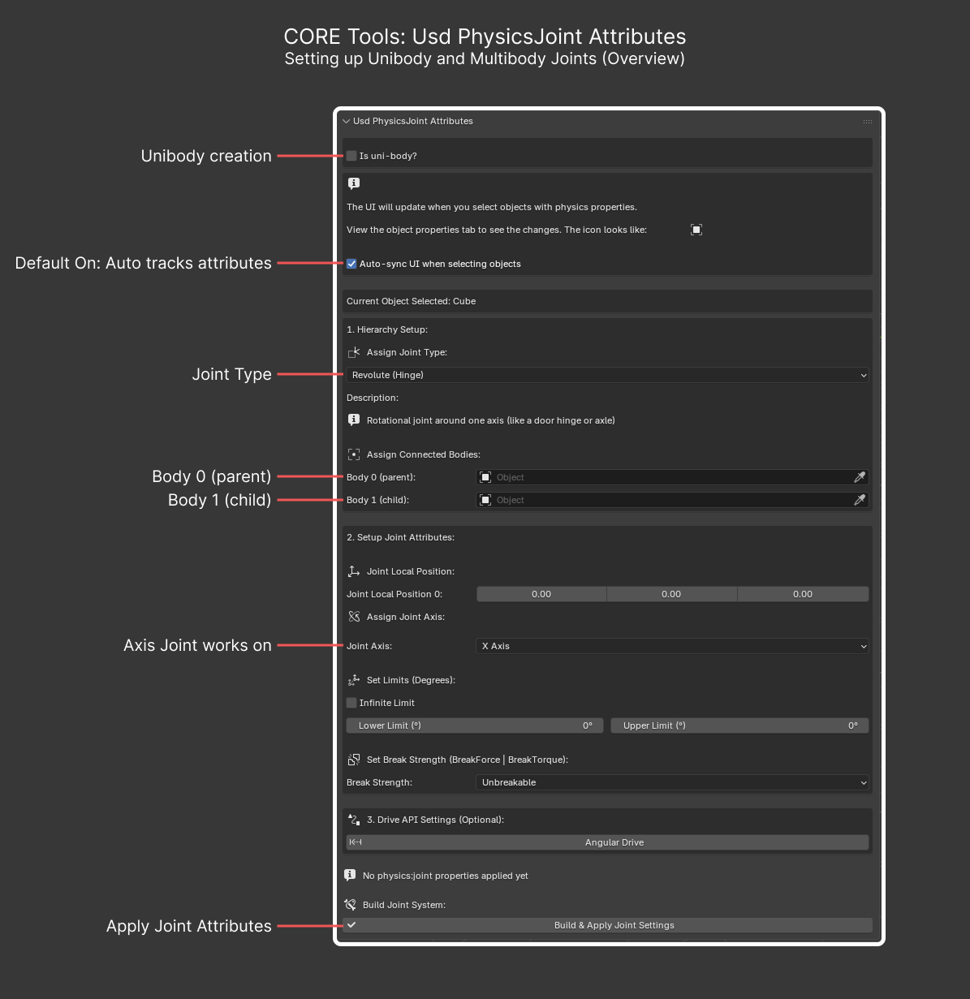{w=800px}

#### Uni-Body Creation
A uni-body asset is a single object with no moving parts. It contains only one rigid body. Examples include an orange, a cup, and a thumbscrew.
{w=800px}

- `Is uni-body?`: Shifts the UI for uni-body creation.
- `Body 0 (Parent)`: Choose the object or mesh.
- `Build Joint System`: Builds the correct collections and hierarchy, applies the necessary pxr-schema properties, and prepares the asset for export.

#### Revolute Joint Creation
A revolute joint can rotate around one axis. Examples include a door hinge and a container lid.

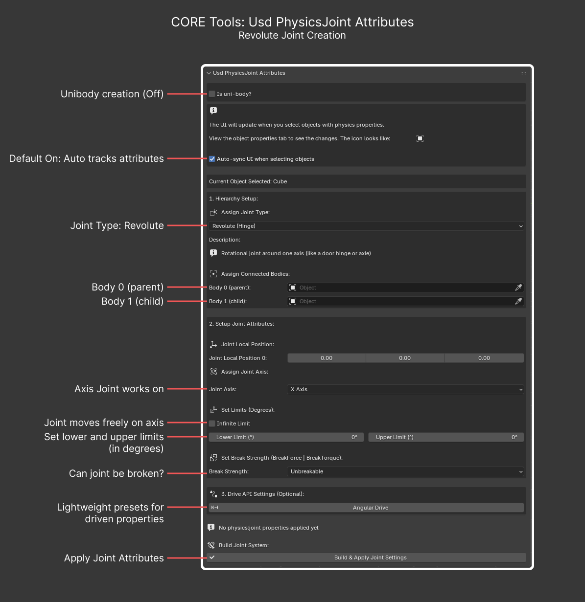{w=800px}

- `Is uni-body?`: Leave off (otherwise the UI engages uni-body creation).
- `Auto-sync UI when selecting objects`: Usually best to leave on. If the object has previously applied pxr attributes, the UI syncs back to those values.
- `Assign Joint Type`: Switch to `Revolute (Hinge)` to switch the UI to revolute-joint creation.
- `Body 0 (Parent)`: Choose the parent object of the joint. For example, with a door and wall, the wall is usually Body 0.
- `Body 1 (Child)`: Choose the child object of the joint. For example, with a door and wall, the door is usually Body 1.
- `Joint Axis`: The axis the joint rotates around. Works on both the world axis and the object's local axis. Do **not** apply rotation transforms if you want the joint to rotate around its local axis.
- `Infinite Limit`: Enable this toggle if you know the joint rotates freely around the selected axis. For example, a chair's caster wheel can always rotate freely.
- `Limits`: Set the lower and upper limits in degrees (not radians). Setting `Infinite Limit` disables limits. The lower number is always the lower limit; for example, if the joint goes from 0 to -95 degrees, set `Lower Limit` to -95 and `Upper Limit` to 0.
- `Break Strength`: Presets for the joint's break strength. The presets are not scientifically measured; they were added for convenience and are not 100% accurate.
- `Angular Drive`: Presets for driven systems. This preset is still in development and does not always work properly. Physics tuning is tricky, so one preset rarely matches every case.
- `Build Joint System`: Builds the correct collections and hierarchy, applies the necessary pxr-schema properties, and prepares the asset for export.

#### Prismatic Joint Creation
A prismatic joint can slide along one axis. An example is a desk drawer.

{w=800px}

- `Is uni-body?`: Leave off (otherwise the UI engages uni-body creation).
- `Auto-sync UI when selecting objects`: Usually best to leave on. If the object has previously applied pxr attributes, the UI syncs back to those values.
- `Assign Joint Type`: Switch to `Prismatic (Slider)` to switch the UI to prismatic-joint creation.
- `Body 0 (Parent)`: Choose the parent object of the joint. For example, with a drawer and a cabinet, the cabinet is usually Body 0.
- `Body 1 (Child)`: Choose the child object of the joint. For example, with a drawer and a cabinet, the drawer is usually Body 1.
- `Joint Axis`: The axis the joint slides along. Do **not** apply transforms in most cases; the system reads the object's world transforms.
- `Limits`: Set the lower and upper limits in meters. For example, if the joint goes from 0 to -0.2 m, set `Lower Limit` to -0.2 and `Upper Limit` to 0.
- `Break Strength`: Presets for the joint's break strength. The presets are not scientifically measured; they were added for convenience and are not 100% accurate.
- `Linear Drive`: Presets for driven systems. This preset is still in development and does not always work. Physics tuning is tricky, so one preset rarely matches every case.
- `Build Joint System`: Builds the correct collections and hierarchy, applies the necessary pxr-schema properties, and prepares the asset for export.

#### Fixed Joint Creation
A fixed joint does not move. An example is a shelf attached to an upright.

{w=800px}

- `Is uni-body?`: Leave off (otherwise the UI engages uni-body creation).
- `Auto-sync UI when selecting objects`: Usually best to leave on. If the object has previously applied pxr attributes, the UI syncs back to those values.
- `Assign Joint Type`: Switch to `Fixed` to switch the UI to fixed-joint creation.
- `Body 0 (Parent)`: Choose the parent object of the joint. For example, with an upright and a shelf, the upright is usually Body 0.
- `Body 1 (Child)`: Choose the child object of the joint. For example, with an upright and a shelf, the shelf is usually Body 1.
- `Break Strength`: Presets for the joint's break strength. The presets are not scientifically measured; they were added for convenience and are not 100% accurate.
- `Build Joint System`: Builds the correct collections and hierarchy, applies the necessary pxr-schema properties, and prepares the asset for export.

### Grasp Setup
The **Grasp Setup** panel, also referred to as the *canonical grasp* system, provides two points and asks you to move them until the line between the points intersects the object to be grasped. By doing this, you prove to the system that the object can and should be grasped from one place.

> **Note:** You only need to create one grasp.

`SRCORE_PT_grasp_setup`: Author grasp pairs or spheres on a prop (used downstream by runtime tests).

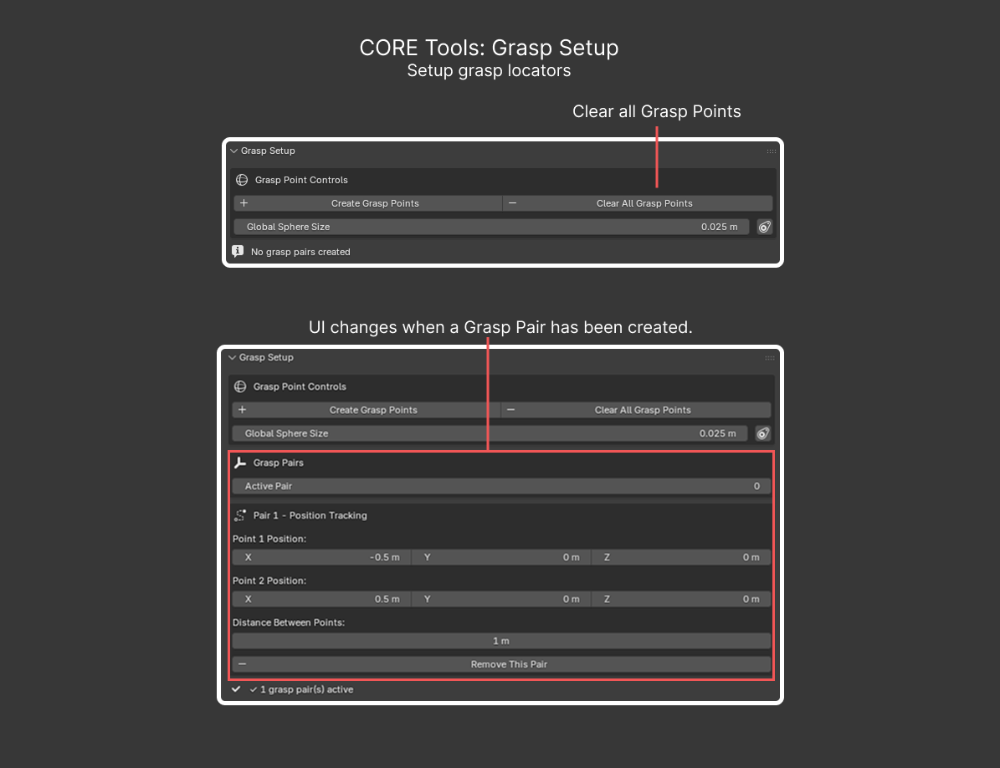{w=800px}

For more information about how grasp points work, refer to [How to add grasp points](https://github.com/NVIDIA/simready-blender-add-on/blob/main/docs/faq_helpers/5_How_to_add_grasp_points.mp4).

### Thumbnailer

`CORE_PT_Thumbnailer`: Load a standardized lighting rig and camera setup, then render single thumbnails or a turntable for the active asset. Operators:

- `core.load_lighting_rig`
- `core.auto_thumbnail`, `core.render_thumbnail`, `core.render_turntable`
- `core.select_light_prim`, `core.toggle_safe_areas`, `core.reset_thumbnail_camera`

This replaces the older standalone **Lighting** panel; the legacy `pt_lighting.py` is no longer registered in the add-on.

<!-- TODO: capture screenshot at doc_images/thumbnailer_panel.png -->

### Asset Profiles

`CORE_PT_Asset_Profiles_Validation`: Pick a SimReady asset profile from a dropdown menu (for example, a specific feature or requirement set). Validation against profiles is a work in progress. The Apply operator (`core.apply_profile`) is currently a stub for future profile-driven validation.

<!-- TODO: capture screenshot at doc_images/asset_profiles_panel.png -->

### SimReady Checklist

`CORE_PT_ArtistChecklist`: Use a step-by-step authoring checklist dialog to confirm you have completed the SimReady setup steps for an asset (such as for metadata, materials, and collisions). Operators:

- `core.artist_checklist_launch`
- `core.artist_checklist_reset`
- `core.artist_checklist_mark_all`
- `core.artist_checklist_tip`

<!-- TODO: capture screenshot at doc_images/checklist_panel.png -->

### SimReady Blender CORE Logs

`CORE_VIEW3D_PT_AddonHelpPanel`: Gain quick access to the add-on's log files. This is useful when reporting issues. Operators:

- **Open Logs Folder** (`core.open_logs_folder`): Opens the logs folder in your file manager.
- **Copy Latest Log Path** (`core.dst_copy_latest_log`): Copies the path of the latest log file to a destination of your choice.

<!-- TODO: capture screenshot at doc_images/logs_panel.png -->

### Preflight and Export

`CORE_PT_Export`: Automatically check mesh, material, and hierarchy in the Blender scene, provide auto-fixes for the problems it can repair, and descriptions for problems it cannot repair. There are two error types: **Error** and **Warning**. An **Error** blocks export. Blender raises a **Warning** if it detects a condition that might be a problem, but does not block export.

Click **Run Validation(s)** to launch the Qt-based validation UI.

{w=800px}

Click **VALIDATE** to start the checks.

{w=800px}

If you see failed checks, click the failed card to open the inspector or auto-fixer.

Click **Autofix** to try to repair the errors.

{w=800px}

Re-run **VALIDATE** to check whether the errors have cleared. When errors are cleared, the **EXPORT SIMREADY** button turns green. Warnings do not block export (only errors).

{w=800px}

A successful export produces a `/simready_usd` folder containing the asset exported as a usd.


## Properties Editor Panels

The following panels are not in the Blender CORE **N-panel**. They are located in the **Properties** editor, where they are most contextually relevant.

### Object > Wikidata Metadata

> **Warning:** Wikidata search requires an internet connection.

`WD_PT_object_panel`: Search Wikidata and apply a Wikidata QID to the selected object as a SimReady semantic label. This is important for downstream machine learning (ML) segmentation.

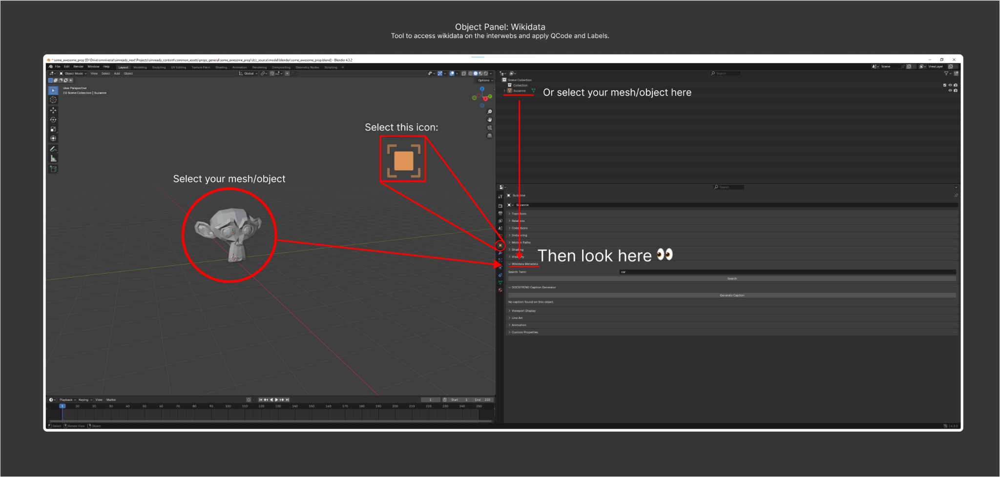{w=800px}
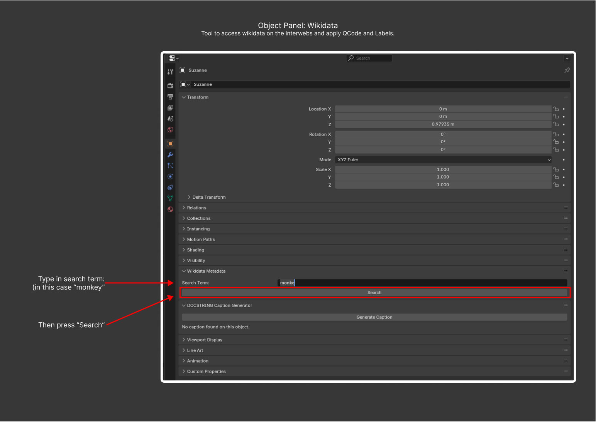{w=800px}
{w=800px}
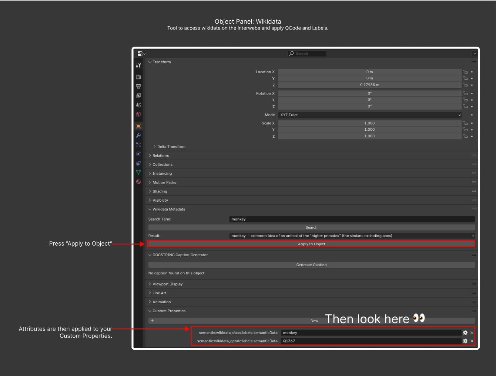{w=800px}

> **Tip:** After applying the QID, you can also edit the field manually or run another search.

> **Tip:** The applied Wikidata QID is also visible in the **N-panel > Item > Custom Properties**.

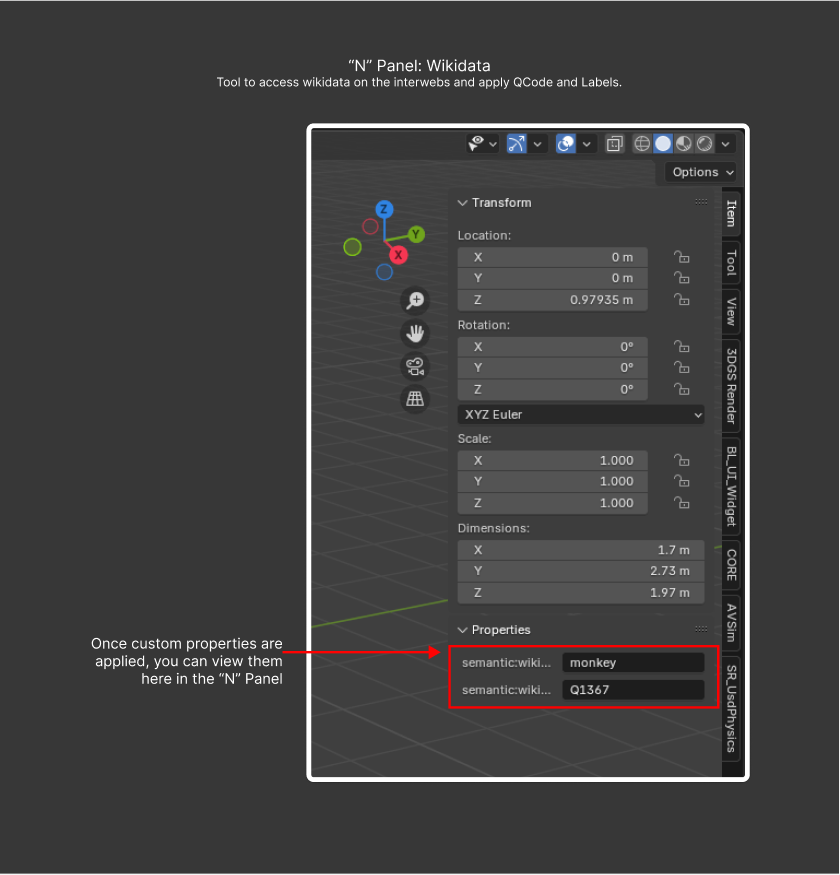{w=800px}

### Object Data > Wikidata Metadata

`WD_PT_data_panel`: Review the data that the Wikidata API has applied to the object and its mesh data, and remove the data if you are not satisfied with it.

### Material > SimReady Non-Visual Settings

`MATERIAL_PT_simready_nonvisual`: Non-visual sensor attributes used by the <a href="https://docs.omniverse.nvidia.com/materials-and-rendering/latest/rtx-renderer.html" target="_blank" rel="noopener noreferrer">NVIDIA RTX renderer</a> to model how a material reads to non-visual sensors such as radar, lidar, or infrared (IR). The panel lets you manage Base, Coating, and Attributes. For example: base = `aluminum`, coating = `painted`, attributes = `emissive, visually-transparent, single-sided`.

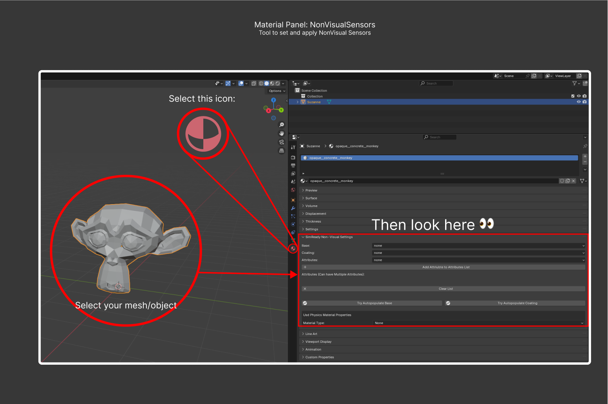{w=800px}
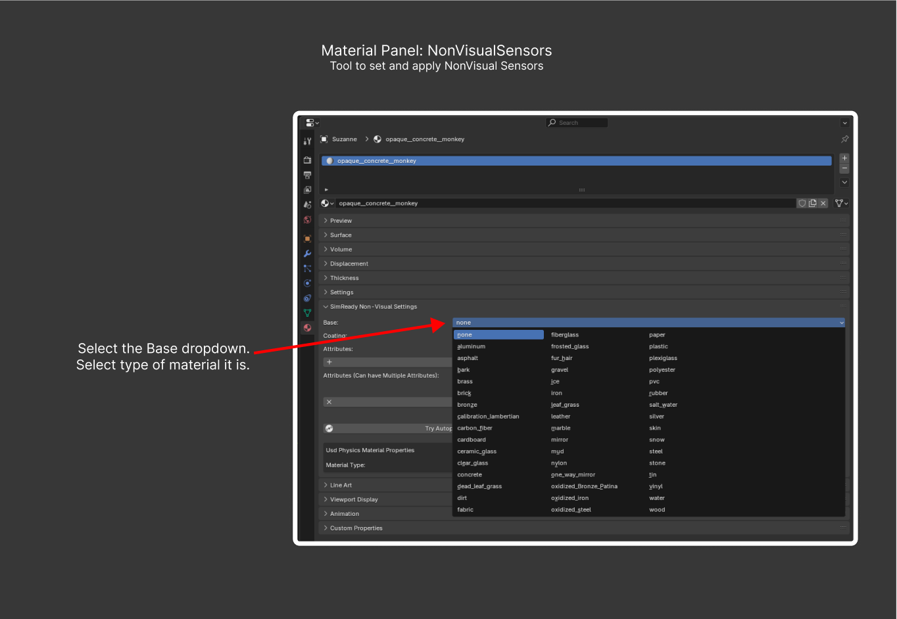{w=800px}
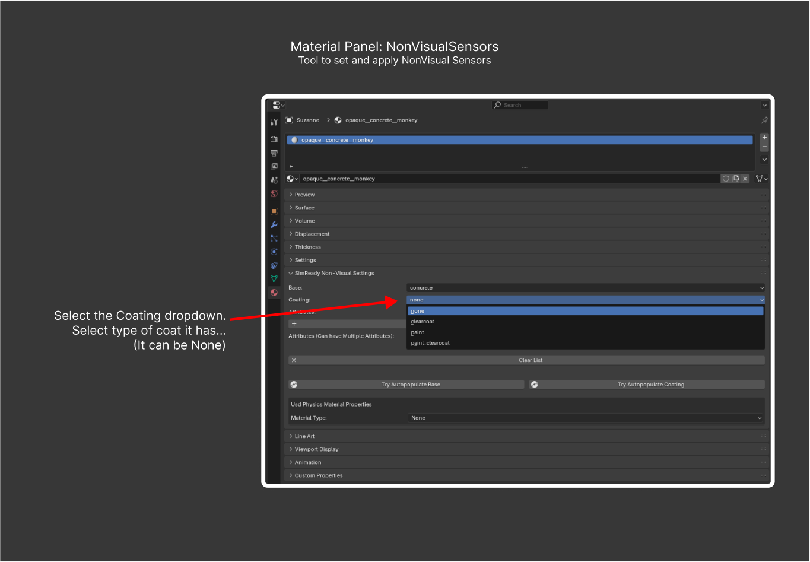{w=800px}
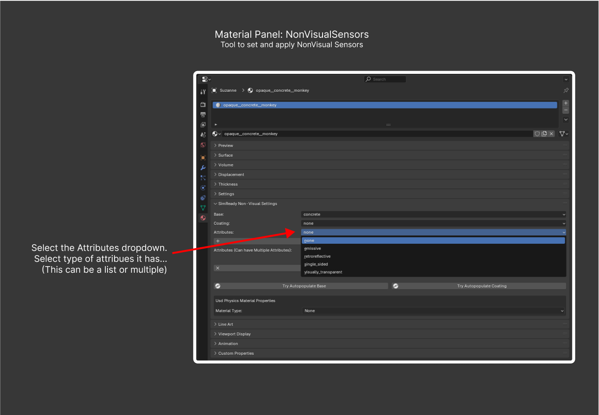{w=800px}
{w=800px}
{w=800px}

The panel also exposes **Assign Usd Physics Properties** and **Update Usd Physics Properties** so a JSON sidecar of PhysX material properties can be attached to each material:

- `simready.add_enum_to_list`, `simready.clear_enum_list`
- `simready.autopop_base`, `simready.autopop_coating`
- `simready.assign_physx_properties`, `simready.update_physx_properties`

### Object > Dense Captions

Dense captions are detailed human-readable descriptions of an asset that are used for scene understanding (for example, "A red, two-door sports car with a tan leather interior and chrome rims"). The add-on lets you enter the description.

{w=800px}
{w=800px}
{w=800px}
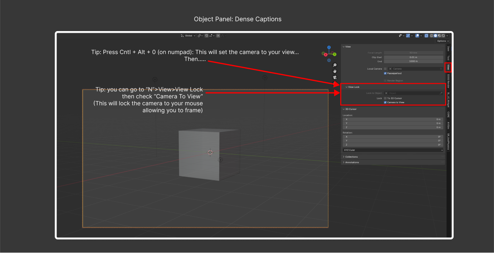{w=800px}
{w=800px}

> **Tip:** You can optionally enable the BLIP (Bootstrapping Language-Image Pre-training) AI model to set up dense captions. However, the AI-generated caption is only a starting point. Add detail and correct mistakes as needed.

### Materials Naming

The dedicated **Materials Naming** panel is now under **Quick Tools → Create Material Names** (refer to [Child Sub-panels](#child-sub-panels)). Earlier screenshots are included here for reference.

{w=800px}
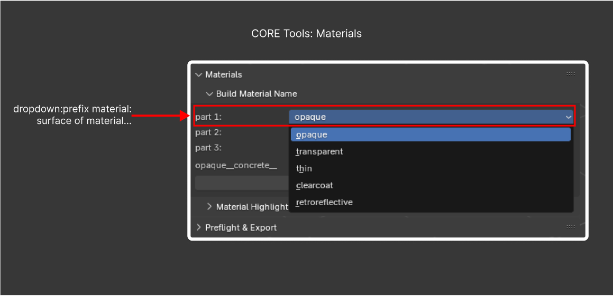{w=800px}
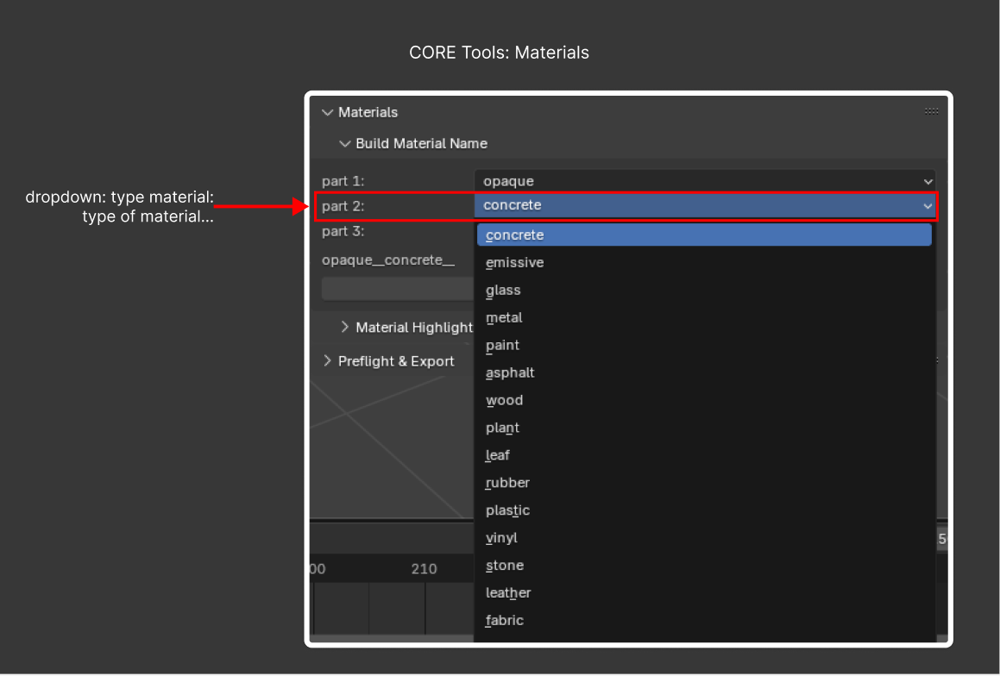{w=800px}
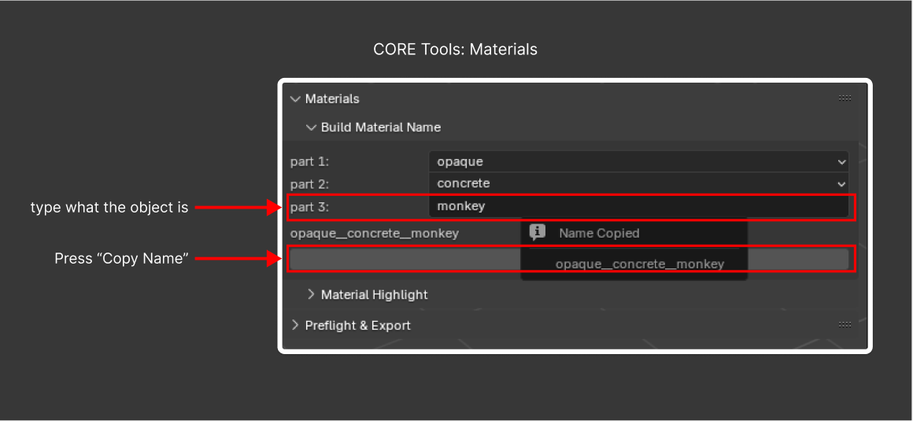{w=800px}
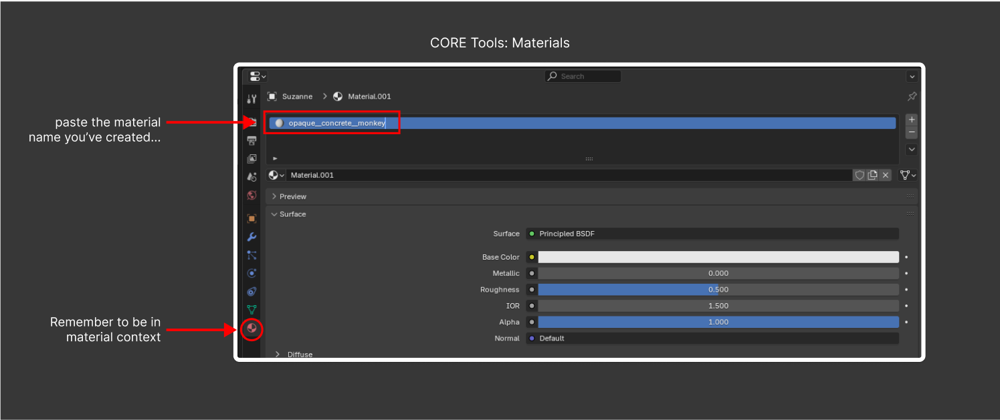{w=800px}

## File Menu Integrations

- **File > Export > SimReady USD (.usd)**: `export_scene.simready_usd` (same export pipeline used by **Preflight and Export**)
- **File > Import > Import SimReady USD**: `simready.import_usd`
- **File > Import > MJCF (MuJoCo) (.xml)**: `sr_core.import_mjcf_with_converter`

## USD Hook

`SimReady_USDHook` (registered as a `bpy.types.USDHook`) participates in Blender's USD import/export pipeline behind the scenes. There is no UI panel; it runs automatically when Blender does USD I/O.

## Troubleshooting

### Why Does Autochecker Keep Flagging My Textures as in the Wrong Location?

**Answer 1:** The check enforces **relative** texture paths to prevent downstream failures when other artists reference the texture. For example, suppose Artist A loads textures from their Downloads folder, or Artist B saves textures from Substance Painter into a working directory and forgets to move them. The check remaps and copies textures into `/Texture` (re-linking the material on success) so a future artist working on a different machine can access them.

### Why Does Autochecker Keep Flagging My Textures as Too Large?

**Answer 1:** The current cap is **4096×4096**. Standards can be revisited; if this cap is too restrictive, file an issue.

### Why Does Autochecker Keep Flagging My Texture Dimensions as Wrong?

**Answer 1:** This check enforces **power-of-two** texture sizes (128, 256, 512, 1024, 2048) for two reasons:

- Cleanliness: A 127×128 texture is almost always a tired-artist accident.
- Compressed formats like `.dds` (GPU compression) error on non-power-of-two sizes such as 227×256.

### Why Is the Autochecker Not Finding My Asset Type?

**Answer 1:** The SimReady Autochecker infers Asset class from the on-disk **folder structure**. If your asset is stored in a non-standard folder structure, it cannot classify it. This is why the **Asset Mgmt > Make Source Directories** flow is recommended.

### Why Does My Material Come Out Pink After Auto-Fixing Textures?

**Answer 1:** A pink material means the texture file does not exist on your system. The most common cause is an artist publishing work with absolute paths. For example:

- Artist A publishes work with absolute paths to their hard drive.
- Artist B picks up the work (from a shared disk) but cannot resolve those absolute paths.

Paths are no longer on a shared drive; be mindful when publishing.

**Answer 2:** Blender supports **Packed Textures** (textures embedded into the `.blend`). The SimReady Blender CORE Add-on handles this case but corner-cases still slip through. If you hit one, **unpack** the textures and continue.
