# SimReady Blender Add-on Workflow

[Getting Started](#getting-started)
- [User Personas](#user-personas)
- [This Document](#this-document)
[SimReady Introduction and Terminology](#simready-introduction-and-terminology)
- [SimReady Specification](#simready-specification)
- [SimReady Foundations](#simready-foundations)
[SimReady Blender E2E Workflow](#simready-blender-e2e-workflow)
- [Introduction](#introduction)
   - [DCC Blender \-\> SimReady](#dcc-blender---simready)
   - [SimReady Foundations](#simready-foundations-1)
- [Setting up](#setting-up)
   - [Prerequisites](#prerequisites)
   - [SimReady Foundation Setup](#simready-foundation-setup)
   - [Blender Setup](#blender-setup)
      - [Install Blender](#install-blender)
      - [Launch Blender](#launch-blender)
         - [SimReady Blender CORE Tools Installation](#simready-blender-core-tools-installation)
      - [Link the SimReady Blender Add-on to SimReady Foundations](#link-the-simready-blender-add-on-to-simready-foundations)
      - [Troubleshooting SimReady Blender Add-on Installation Issues](#troubleshooting-simready-blender-add-on-installation-issues)
      - [Uninstalling the SimReady Blender Add-on](#uninstalling-the-simready-blender-add-on)
- [Creators Workflow](#creators-workflow-dcc-blender---simready)
- [DCC Blender \-\> SimReady](#creators-workflow-dcc-blender---simready)
   - [Creating an Asset](#creating-an-asset)
   - [Basic Asset Setup](#basic-asset-setup)
      - [Setting up the Asset’s Source Folder(s)](#setting-up-the-assets-source-folders)
      - [Open up the obs_orange_starter Sample](#open-up-the-obs_orange_starter-sample)
   - [Extended Features Setup](#extended-features-setup)
      - [Apply Physics Materials \- FET_003 and FET_004](#apply-physics-materials---fet_003-and-fet_004)
      - [Setup Physics Joints and Rigid Bodies \- FET_003 and FET_004](#setup-physics-joints-and-rigid-bodies---fet_003-and-fet_004)
      - [Set up Canonical Grasp(s) \- FET_005](#set-up-canonical-grasp-s---fet_005)
   - [Exporting Asset as USD](#exporting-asset-as-usd)
[Troubleshooting](#troubleshooting)
- [Common Issues](#common-issues)
- [Diagnostic Steps](#diagnostic-steps)

## Getting Started

This workflow demonstrates the process of converting a Blender prop asset into SimReady, and then exporting it.

Note that the SimReady Foundation MVP (Minimum Viable Product) has three MVP features that are demonstrated in the samples:

* Geometry - Minimal Placeable Visual  
* Rigid Body Physics  
* Grasp Physics

### User Personas

This document assumes you are a **Content Creator** responsible for creating 3D assets for simulation, and that you work primarily in source DCC (digital content creation) applications like Blender or Maya, or CAD applications like Creo, Revit, NX, or SOLIDWORKS. It assumes you have limited or no coding or application development experience, and your workflows are typically focused around technologies that connect to your existing source applications or are easy to install and run.

This workflow assumes you use Blender as your DCC application.

### This Document

This document guides you through the end-to-end process of taking a standard Blender asset and augmenting it to make it SimReady. It ends when you export the asset.

## SimReady Introduction and Terminology  

### SimReady Specification

A SimReady *specification* describes how to create content enriched with specific simulation features. Each feature ladders up to a simulation workflow (such as reinforcement learning).

### SimReady Foundations

The SimReady Foundation encompasses the entire process from content creation to runtime, enabling enforcement of validation rules, runtime feature compatibility, and pipelines to bridge all of the software components. 

It has clear sections:

* **Features** represent simulation capabilities such as SDG, physics, rendering, and animation. They are defined independently but can depend on one another. Each feature includes versioned documentation, samples, validations, and automation for runnable forms.
* **Capabilities** include core asset properties such as geometry, material, rigid body physics, and rule sets that can expand over time to support simulation requirements.  
* **Profiles** include combinations of features that represent how assets are created for specific use cases. Profiles allow multiple features to be grouped and tracked together for compatibility and pipeline integration.	  
* The **Sample Assets** library is a small repository of ready-made SimReady assets. These assets provide a starting reference for how to create assets.

  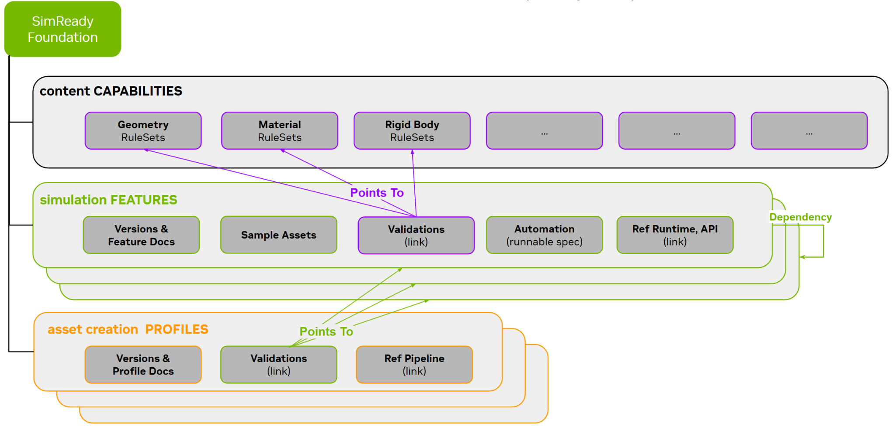

SimReady specifications are needed by the following personas:

* **Application Developers** who want to define or derive a SimReady spec around a simulation feature.  
* **Content Creators** who want to use SimReady Pipelines. Refer to the SimReady Pipelines section for more details.

## SimReady Blender E2E Workflow

### Introduction

Workflows are divided into the following categories:

* **Content Creator or Publisher**

  * DCC Blender -> SimReady

#### DCC Blender -> SimReady

**Creator (using SimReady Blender Add-on)**  
  * Syncs a Workspace and Foundation to the local environment.  
  * Creates source assets in the form of `.blend` in Blender.
  * Exports assets using the SimReady Blender Add-on in a local Workspace.

#### SimReady Foundations Overview

More detailed docs for Foundations are in the foundations zip at 
<a href="https://nvidia.github.io/simready-foundation/guides/guides.html" target="_blank" rel="noopener noreferrer">SimReady Foundation guides</a>

  * You can view the docs with a typical web browser (such as Chrome, Firefox, or Edge).
  * Review the **Profile**, **Features**, **Capabilities**, and **Requirements** for details around each aspect.

  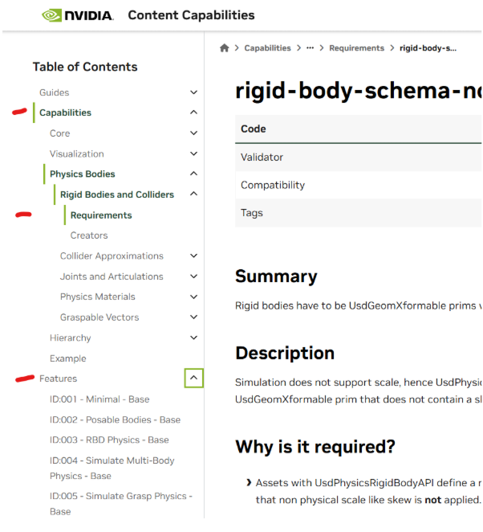

## Setting up

### Prerequisites

1. Requirements:

   - Windows 10 or Windows 11 (tested on Windows 11)
   - SimReady Foundations and dependencies (latest version)
   - Blender 5.0 or later (5.1 recommended)
   - Python 3.12
   - Git and Git LFS 

   **Note:** **Linux** is coming soon.  

**Important:** Before proceeding, create a root folder on your hard drive to hold the items listed below. You can give it any name; this guide uses `sr_dev`. (If you already have an `sr_dev` folder, rename it, or substitute your root folder name in the instructions. In either case, start with an empty folder.)

**Note:** You can use any local drive. Instructions in this guide refer to `C:\` for documentation flow.

### SimReady Foundation Setup

Repository location: <a href="https://github.com/NVIDIA/simready-foundation" target="_blank" rel="noopener noreferrer">SimReady Foundation</a>

1. Follow the README.md instructions to clone the repo to your hard drive. 
2. When you've cloned the repository, look for two folders:
   - **nv_core**
   - **sample_content** 

3. You can either copy those two folders into a new folder (which you make yourself called `C:\sr_dev\foundations\`), or you can use the cloned repository. This guide assumes you have copied the folders to `C:\sr_dev\foundations\`.

You should now have a `C:\sr_dev\foundations\nv_core` folder and a `C:\sr_dev\foundations\sample_content` folder.

### Blender Setup

#### Install Blender

1. Download Blender from <a href="https://download.blender.org/release/Blender5.1/blender-5.1.0-windows-x64.msi" target="_blank" rel="noopener noreferrer">blender 5.1 (official msi)</a>.  
2. Follow the default installation instructions.

   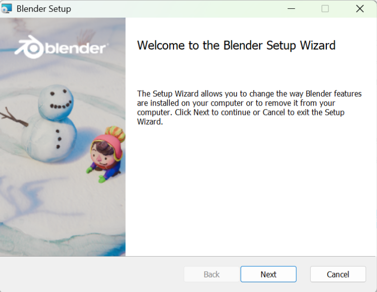

**Note:** Throughout this guide, the screenshots appear before descriptions of the steps, buttons, and UI elements that are relevant for your actions.

**Note:** Unless specifically noted, do not skip any steps.

#### Launch Blender

   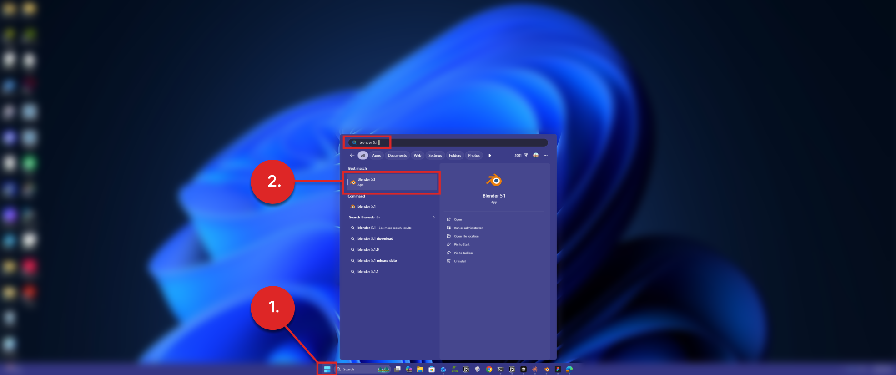

1. Click the Windows **Start** button **(1)** and search for "Blender 5.1".
2. Click **Blender 5.1** to start Blender.

#### SimReady Blender CORE Tools Installation

1. In a browser, go to the <a href="https://github.com/NVIDIA/simready-blender-add-on/releases/tag/2026.04.0" target="_blank" rel="noopener noreferrer">SimReady Blender Add-on release</a>.
2. Download **SimReady_Blender_CORE_2026.4.0.zip**.
3. By default, the download goes to "C:\<User>\Downloads"; you do not need to move it.

The SimReady Blender Add-on package is named `SimReady_Blender_CORE_2026.4.0.zip`.

You use **Blender Preferences** to install the SimReady Blender Add-on, as follows:

1. Go to your Blender application. (If it is closed, [open it](#launch-blender).)
2. Open **Blender Preferences**.

   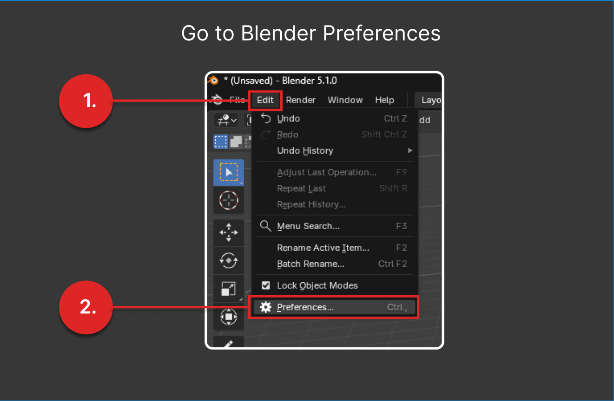

3. Click **Edit (1)**.  
4. Click **Preferences… (2)**.

   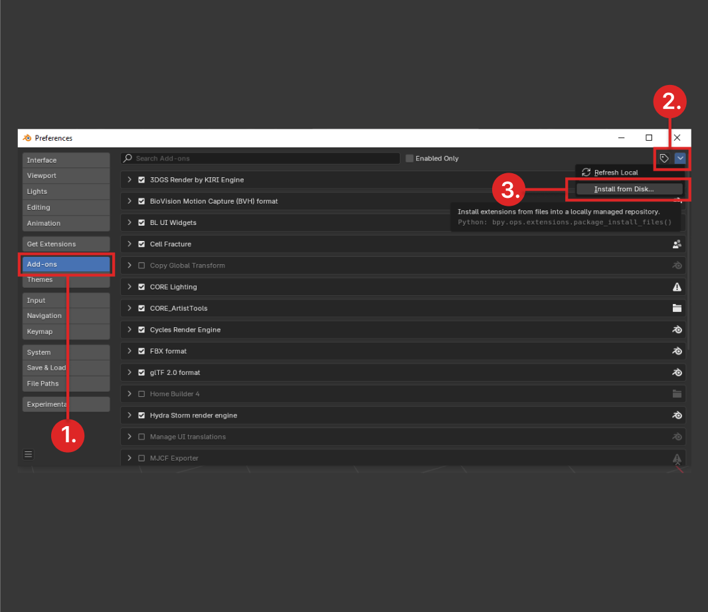

5. Click **Add-ons (1)**.  
6. Click the down arrow **(2)** on the top right corner of the window, adjacent to tag icon. 
7. Click **Install from Disk…** **(3)** from the dropdown.  

   

8. Navigate to the `SimReady_Blender_CORE_2026.4.0.zip` file. **(1)**.  
9. Select `SimReady_Blender_CORE_2026.4.0.zip`. **(2)**  
10. Click **Install from Disk** **(3)**.

Wait for the installation to complete; it might take a few minutes depending on your internet speeds. Subsequent installs should be much faster.

### Link the SimReady Blender Add-on to SimReady Foundations

For the SimReady Blender Add-on to work smoothly, it needs to have a connection to SimReady Foundations. You create that connection by initializing pointers in the `project_config.toml` configuration file that Blender uses. The `project_config.toml` file is included in the **SimReady Foundations** **package**. 

Follow these steps to set it up. They assume you have already set up [Foundations](#simready-foundation-setup), which is required.

1. Go to **Edit\->Preferences** in the menu bar at the top of the Blender interface.

   

2. In the **Preferences** window, click **Add-ons (1)** on the left side.  
3. Find the **SimReady_Blender_Core** add-on in the main panel **(2)** and click its expansion icon.  

   **Note:** **SimReady Blender Core** is just another name for the **SimReady Blender Add-on**. They are both referring to the same set of tools.

You now need to link the **SimReady Blender CORE** to **SimReady Foundation** functions so its tools can use the Foundation's services.

   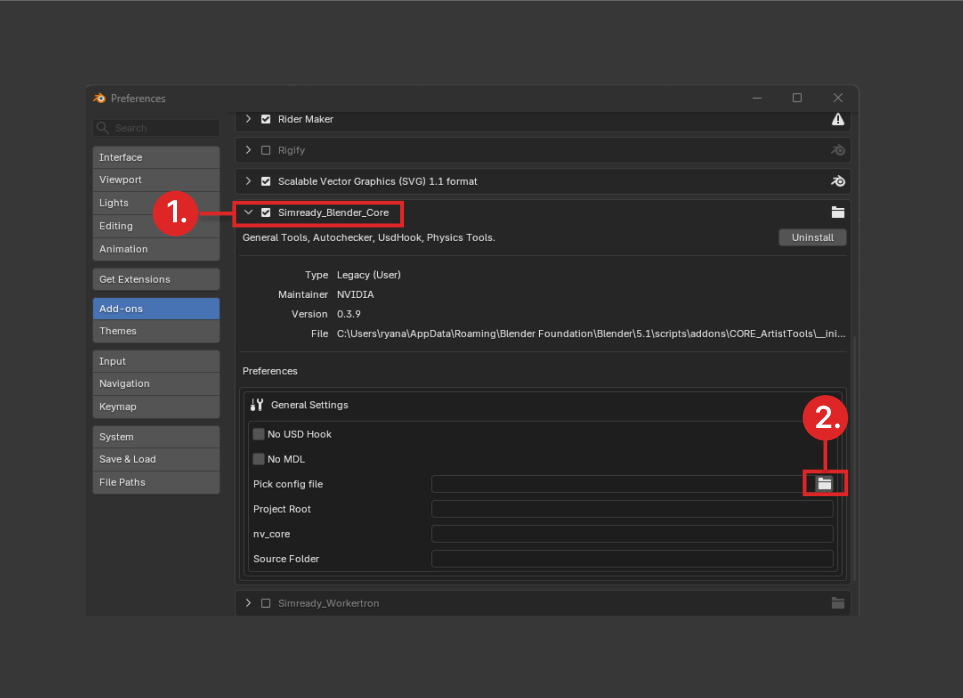

4. Click the expansion icon to expand the **SimReady_Blender_Core** preferences. **(1)**
5. Click the folder icon **(2)**  in **General Settings** (the folder icon inside a red rectangle) to open a file picker to navigate to `project_config.toml`.  

   

6. Locate the `project_config.toml` file located at `<foundations>\sample_content\project_config.toml`. **(1)**  
7. Click **Accept. (2)**

   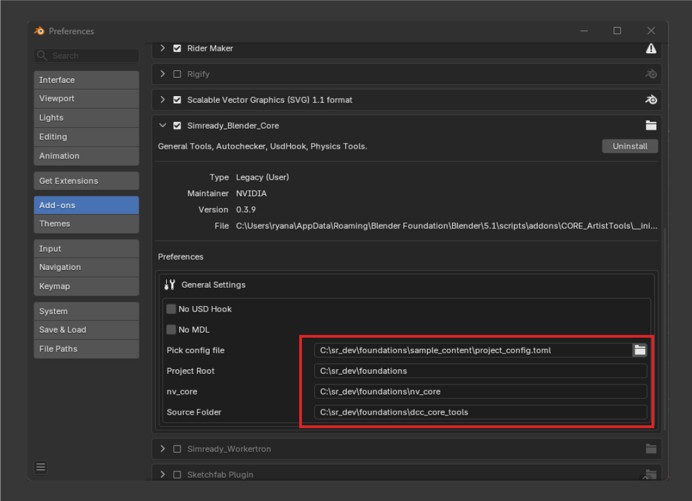  

All file paths (“Pick config file”, “Project Root”, “nv_core”, “Source Folder”) should now point to the Foundations folders necessary for the SimReady Blender Add-on to function properly. If these folder paths remain empty, go back to Step 1, re-select the `project_config.toml` file, and click **Accept**.

### Troubleshooting SimReady Blender Add-on Installation Issues

If you are installing the **SimReady Blender Add-on** for the first time, you might be prompted to restart **Blender** because the install scripts run upon **init**. 

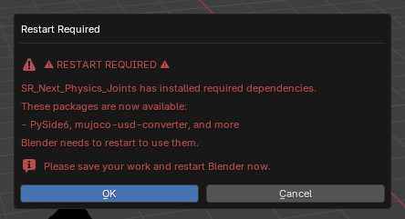  

When you restart, your SimReady Blender Add-on should initialize correctly.

**Important: Always restart Blender after installing the SimReady Blender Add-on** (the first time, and after any future upgrades or updates). The SimReady Blender Add-on does not refresh during an active Blender session.

\*Pip is Python’s package installer, usually from <a href="https://pypi.org/" target="_blank" rel="noopener noreferrer">PyPI</a>.

### Uninstalling the SimReady Blender Add-on

Use this procedure if you need to uninstall the SimReady Blender Add-on.

   

1. [Start / Open Blender 5.1](#launch-blender).  
2. Click **Edit (1)** then...
3. Click **Preferences (2)** to open the **Preferences** window.

   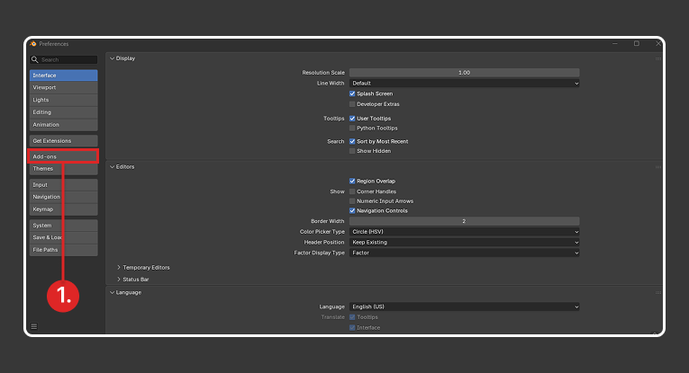

4. Select **Add-ons**. **(1)**

   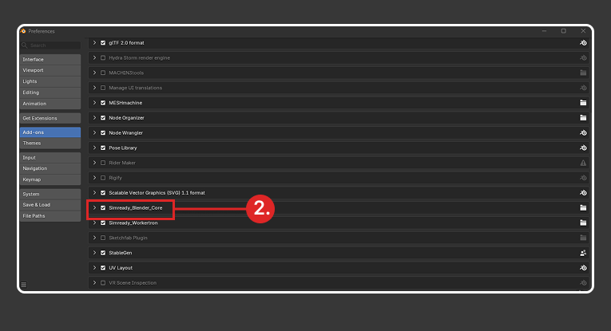

5. Find the **SimReady_Blender_Core** add-on **(2)** and click the expand arrow: 

   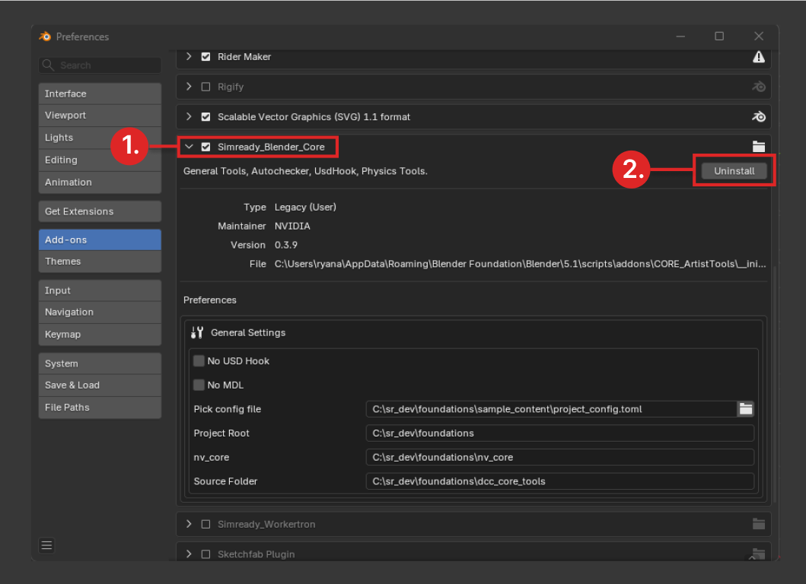

6. Search for SimReady_Blender_Core. **(1)**
7. Click **Uninstall**. **(2)**

## Creators Workflow DCC Blender -> SimReady

This section describes how to use the SimReady Blender Add-on features in Blender to create a SimReady asset, add physics properties to it, and export it.

### Creating an Asset

This step-by-step procedure assumes you have installed SimReady Foundations, Blender, the SimReady Blender Add-on, and sample assets as described earlier. If you have not done so, go back to the [Setting Up](#setting-up) section and do so before proceeding. You will need Foundations and its files for the remainder of this guide.

You will be working with this sample orange asset.  

### Basic Asset Setup

**Note:** This guide assumes that you are using the Blender's default **hotkey setup**. If you are using different hot keys, then disregard the **hotkey**-related suggestions here.

#### Setting up the Asset’s Source Folder(s)

Before building a new Blender asset, consider the file and project structure. Every asset you create should follow a consistent folder layout, and the SimReady Blender CORE tools provide a quick way to set this up.

This section guides you through creating a sample SimReady asset project folder from scratch using the SimReady Blender CORE tools. Although you will not follow this step in the tutorial workflow (a sample asset is provided for you), understanding this process is essential.

Open Blender.
     
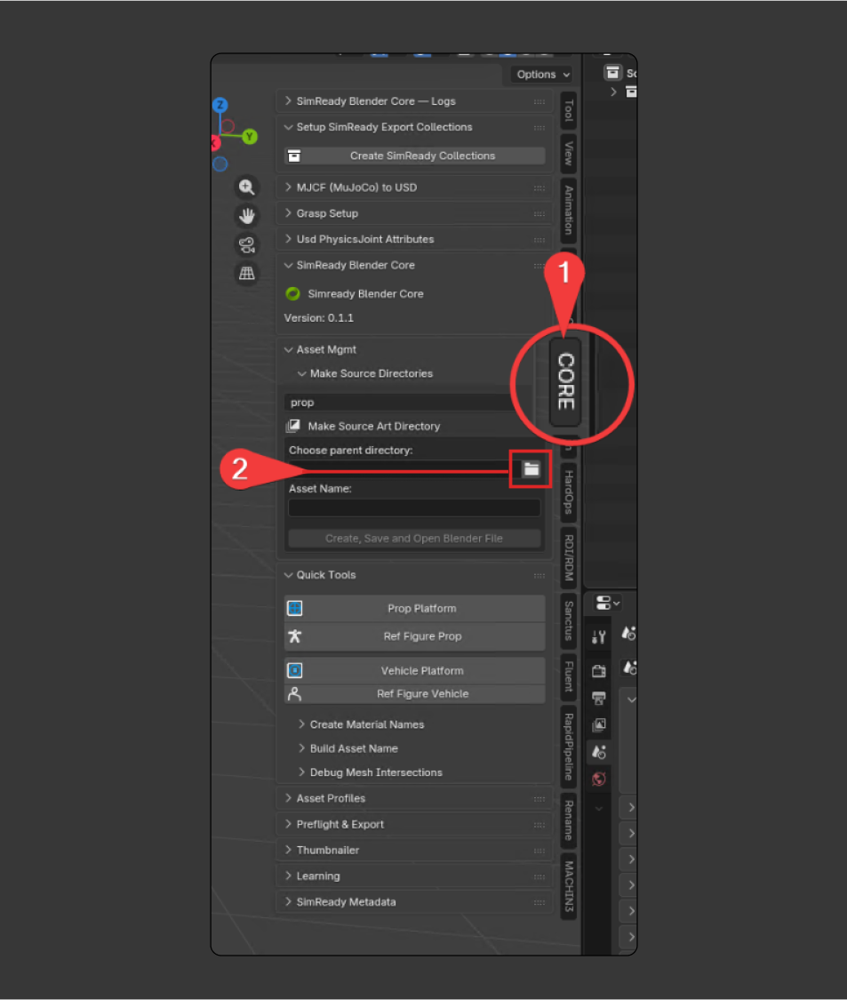

In the Blender 3D Viewport, press the **N-Key** to toggle open the Sidebar.

1. Within the Sidebar, you should have a tab called **CORE**. Select it. **(1)**
2. In the CORE Artist tools UI, look for **Asset Mgmt -> Make Source Art Directory** section. Click the folder icon 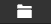 under **Choose parent directory**. **(2)** 

   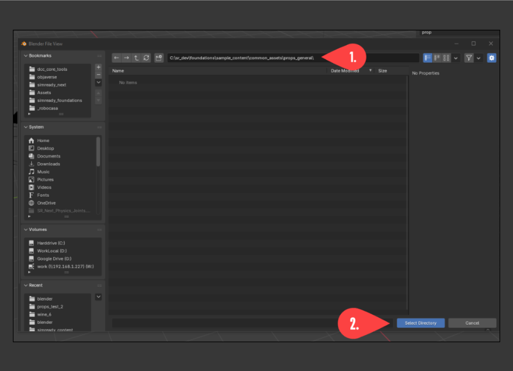

3. In the resulting pop-up, browse to the folder
`C:\sr_dev\foundations\sample_content\common_assets\props_general`. **(1)**  
     
   **Note:** **`sample_content`** is the content folder provided with Foundations. Refer to Foundations setup for details on the files and folders from the `foundations` path.
     
4. Click “**Select Directory**” **(2)**.

   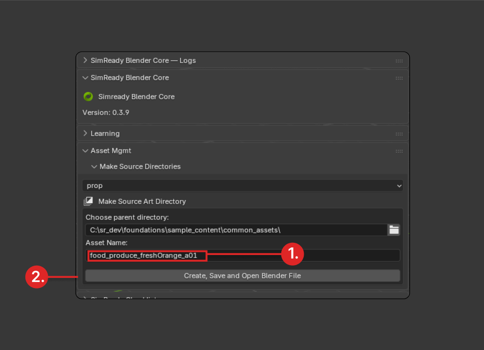

5. In **Asset Name**, name your asset: \<a_nice_descriptive_name_01\>. **(1)** (In this example, the name given was "food_produce_freshOrange_a01".)
6. Click “**Create, Save and Open Blender file**”. **(2)**

   This creates a new project folder inside the chosen parent directory with the name you provided, where your Blender asset metadata is stored. Think of this as a project initialization step. From here, save your work normally using Blender's **File > Save** feature. This structure keeps your Blender assets organized and easy to manage.
   
#### Open up the obs_orange_starter Sample

Now that you are familiar with how the SimReady Blender CORE tools help you set up a new asset in your project structure, the remainder of this guide uses a provided Blender sample file.

1. Go to **File \-\> Open** in Blender.

   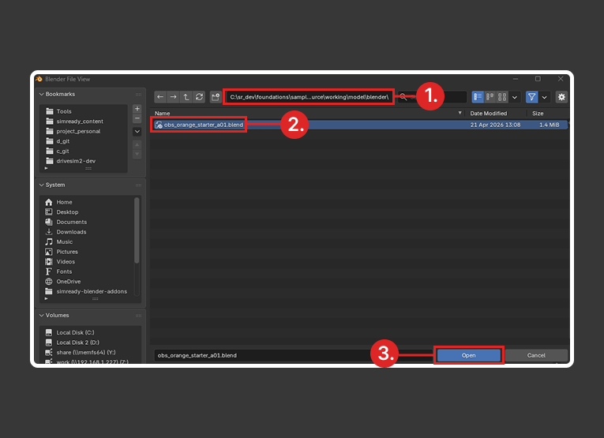

2. Browse to the folder `C:\sr_dev\foundations\sample_content\common_assets\props_general\obs_orange_starter_a01\dcc_source\working\model\blender\`. **(1)**
3. Select the asset **obs_orange_starter_a01.blend**. **(2)**
4. Click **Open (3)**.

   **Note:** For safety, you can **save a copy** of this asset so you always have a clean starting point. In Windows, press **control + shift + s**, or go to **File > Save as**, and save a new starter orange with name **obs_orange_starter_01_backup.blend**. You can then re-open **obs_orange_starter_01_backup.blend** from the **File > Open** file picker or press **control + o** to select it.

There will be an orange at the center of the viewport (press the **Home** keyboard shortcut to frame the orange). This is an example of a model you might receive from a 3D artist or an object purchased from a major 3D marketplace like **TurboSquid**. 

For an asset to be simulated properly, it needs physical attributes that define how the physics engine should handle it. For example, most physics simulators include **colliders**, **rigid bodies**, and **joints**. **SimReady** is no different. Follow along to set up each type of attribute.

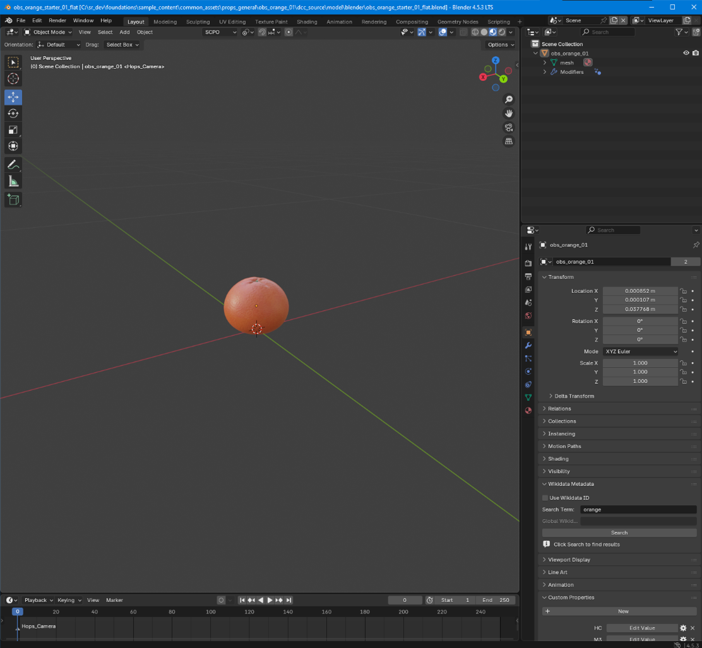 

**Note:** At this point in the process, you could export this sample asset to meet the requirements for the Minimal Placeable Visual Feature (FET_001 from Foundation). The Minimal Placeable Visual Feature comprises a minimal list of necessary requirements to run the base kit application. Minimal means you can manipulate and render it without materials. This might be your reference application, validation application, or test application. However, FET_001 objects cannot be simulated with Physics or graspable by robots. You have to perform [Extended Steps](#extended-features-setup) to add Physics and more features for that.

### Extended Features Setup

#### Apply Physics Materials - FET_003 and FET_004

Physics materials are not native to Blender; they are provided by the **SimReady Blender CORE Tools**. They define simulator attributes such as mass, bounciness, and friction. To apply your first physics material, follow these steps:

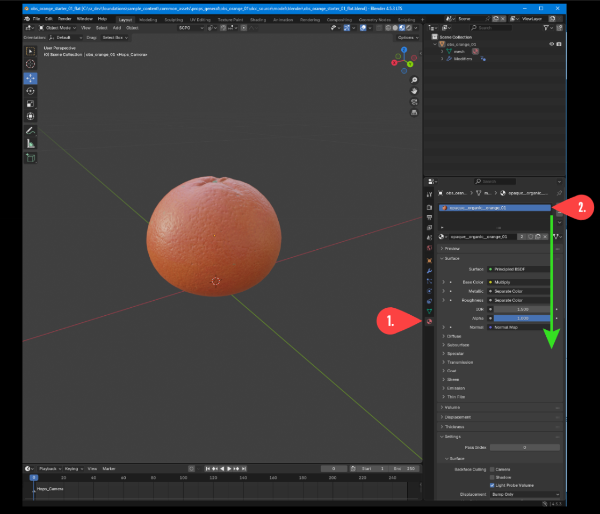

1. Make sure your orange object or mesh is selected, and then click the **Materials Properties** tab **(1)**  in the **Properties** panel. This icon symbolizes Blender’s material context.
2. The orange mesh only has one material assigned to it: ***opaque__organic__orange_01***. Select the material by clicking where the red #2 arrow indicates in the **Properties** panel in the upper right **(2)**. When selected, you can view this material’s attributes lower down in the panel (follow the green arrow).

   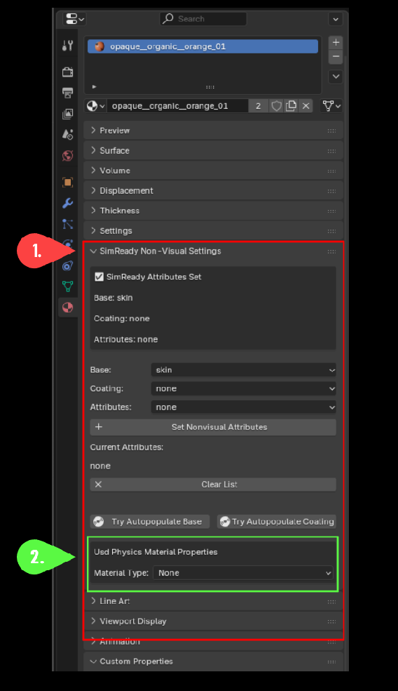

3. Scroll down the material context until you reach the **SimReady Non-Visual Settings** tab. **(1)**
4. Focus closely on attributes directly below **Usd Physics Material Properties**. **(2)**

   **Note:** **Material Type** defaults to **None** in the diagram, but any value is acceptable.

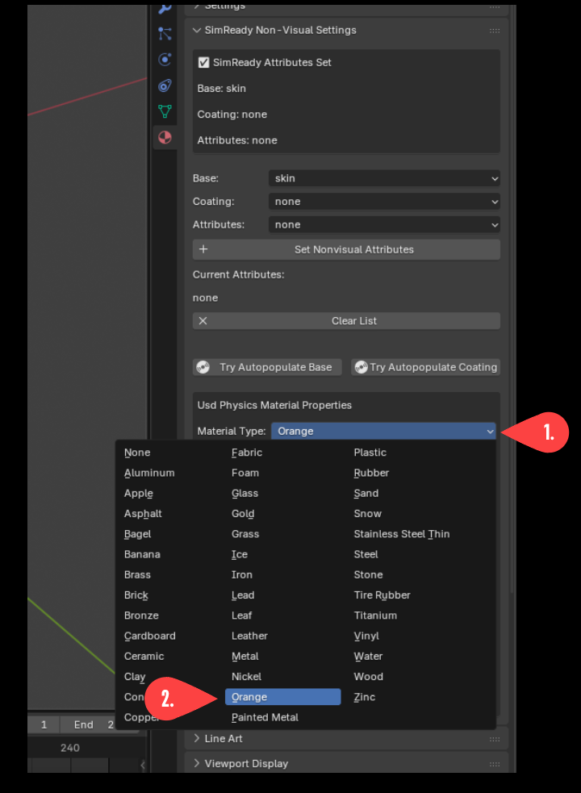

5. Click the **Material Type** dropdown bar. **(1)**.
6. A list of preset Physics material types appears. Since this is an orange, select the **Orange** preset from the list **(2)**.  

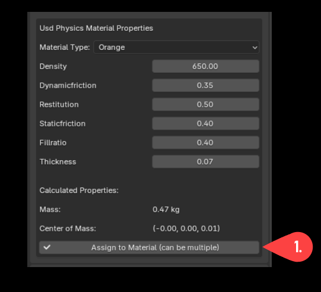

7. Now click **Assign to Material (1)**.

Your asset now has all the attributes necessary to satisfy SimReady requirements and could be exported. For purposes of this example, it still needs to have grasp points that enable it to be picked up.

**Note:** After assigning physics materials, scroll further down in **Material Properties** to find the **Custom Properties** panel. This is where all physics material properties are stored, prefixed with **pxr:usd:physics**.

#### Setup Physics Joints and Rigid Bodies - FET_003 and FET_004

Rigid bodies and physics joints are an important part of setting up multi-bodied or segmented assets that are ready for simulation, but are not relevant for this example (an orange). For more information about how rigid bodies work in USD, refer to <a href="https://openusd.org/dev/api/usd_physics_page_front.html#usdPhysics_rigid_bodies" target="_blank" rel="noopener noreferrer">Rigid Bodies</a>. For more information about how physics joints work in USD, refer to <a href="https://openusd.org/dev/api/usd_physics_page_front.html#usdPhysics_joints" target="_blank" rel="noopener noreferrer">Joints</a>.

Before setting up rigid bodies and joints, consider the object in your viewport and ask a fundamental question: 

* ***Does my asset have any moving parts?***

In this case, the asset is an orange and has no moving parts. This is considered a **Uni-body** asset.

Given this is a simple uni-body asset, follow the steps below to add RBD (Rigid Body Dynamics) physics to it.

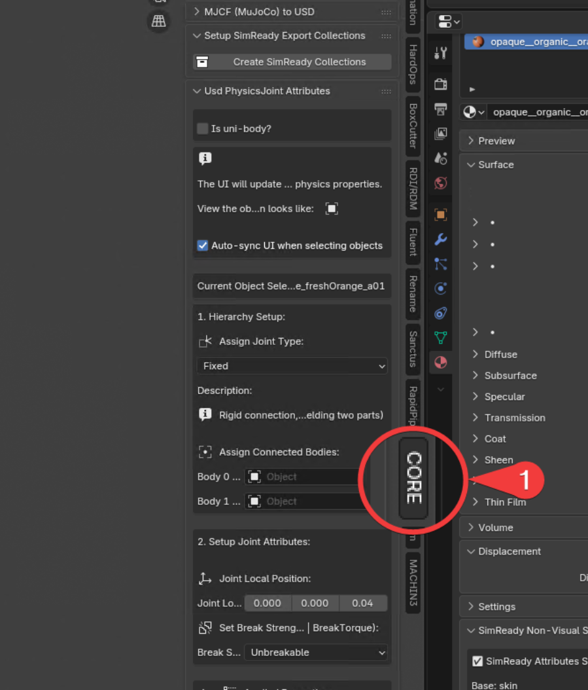

1. In the 3D View, press the **N-key** to bring up the side menu, or click in the upper-right of the 3D View to open the side panel. Select the **`CORE`** panel within it **(1)**. 

   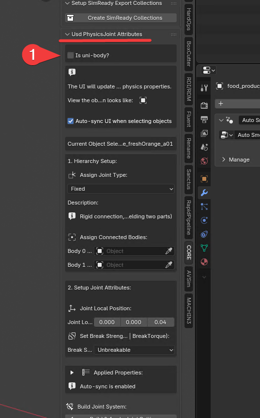

2. Toward the middle of the panel is a section called **Usd PhysicsJoint Attributes.** The first item in that section is the **Is uni-body**? checkbox **(1)**. Ensure this checkbox is selected (checked).

   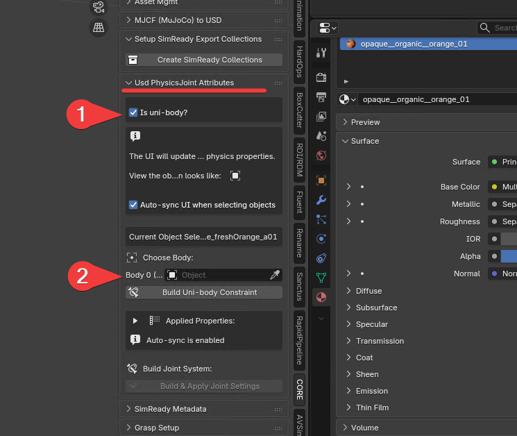

3. When the checkbox is selected, the UI below it shifts into uni-body mode **(1)**.
4. Choose the mesh that represents the object **(2)**. To select the object (the orange asset), follow the steps below.

   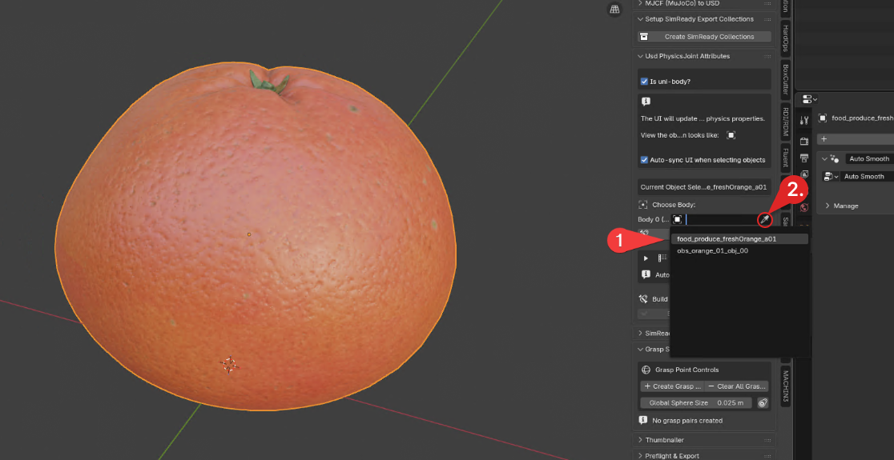

   You have two options to select the object/mesh:  
   - You can click the dialog box, which will act like a dropdown and give you a list of objects that you can select in the scene **(1)**; or 
   - You can click the eyedropper icon  and click the orange in the viewport **(2)**. The eyedropper is in the selection box on the far right, but disappears if you choose a mesh.

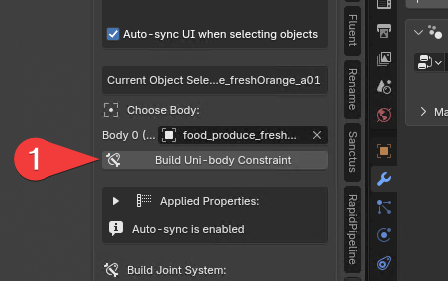  
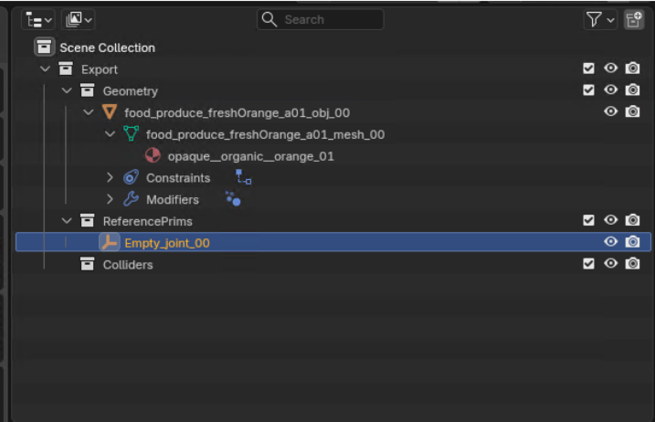

5. Click the button labeled **Build Uni-body Constraint** **(1)**. This creates your Blender constraint system and builds out the collection hierarchy. If you look in the Outliner in the upper right of the Blender UI, it should look similar to the image above. 

You have now set your asset up as a uni-body asset. So far, your asset now has:

* A **rigid body**, with the correct attributes applied.  
* A **physics material** with all its properties:
  * Mass, diagonal tensors, center of mass, friction, and so on  
* The **correct hierarchy structure** in Blender that will export correctly.

Your asset is almost ready to go. You just need to complete one more step before you are ready to export it as a SimReady USD.

#### Set up Canonical Grasp(s) - FET_005

The **Canonical Grasp** feature is a tool to set up **grasp lines** (or vectors) that show robots how to pick up an asset.

To set up a grasp line, follow the steps below.

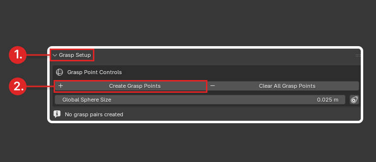

1. While still in the **CORE Tools** panel, find the **Grasp Setup (1)** section.
2. Click **Create Grasp Points (2)**.  
   - Grasp points come as a pair: two points on opposite sides of the object and a line between them. 

     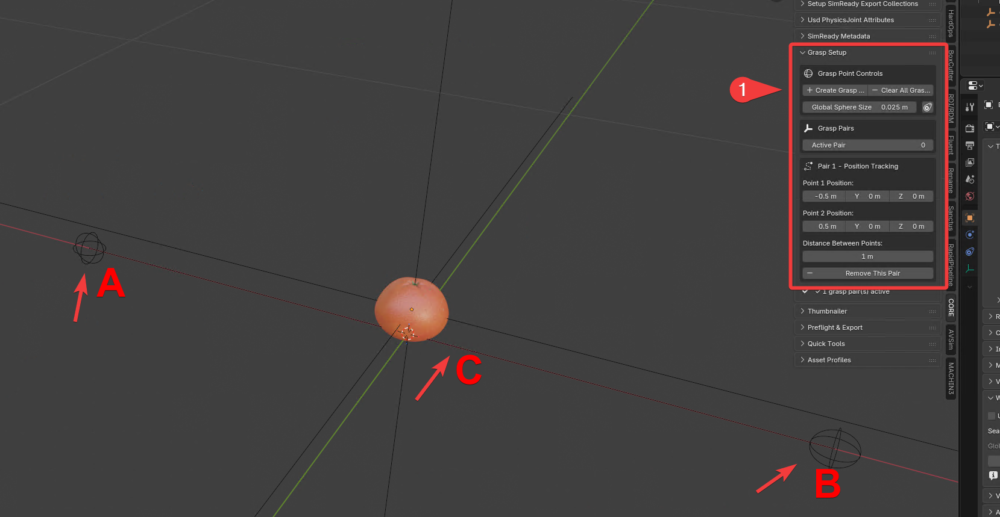

   - The button creates two Grasp Point locators.
     - Grasp_Point_1_1 **(A)**.
     - Grasp_Point_1_2 **(B)**.
   - A line is drawn between the two locators and updates dynamically as you move either one, so it always extends between them. **(C)**
   - The points where the line intersects the object are the grasp points.
   - Your goal is to position the locators so the line crosses the object at plausible pick-up points. In this example, that means on either side of the orange.

3. Position the grasp line:

   After step 2, the panel updates to show line options.

   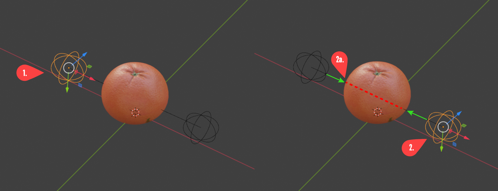

   Move the line by selecting either locator in the 3D view, or by selecting **Grasp_Point_1_1 (1)** or **Grasp_Point_1_2 (2)** in the Outliner. Position them so the line passes through the orange at a plausible grasp location (callout **2a** in the image above).

   When the line intersects the orange, as shown above, the grasp is set up.

   **Important:** 
     - Move the locators only; never select or drag the line itself. Blender expects the line to be derived from the locator positions; moving the line directly causes errors. If this happens, clear the grasp points or delete the locators and start over.
     - Make sure the line actually intersects mesh. If it passes through a gap (for example, the handle of a coffee mug), the system will not register the object as graspable.

   **Why intersect the mesh?** Imagine two robotic grippers moving along the line until they squeeze the object tightly, then lift it. The line/mesh intersection is what lets the system test the asset as **graspable**.

You have completed a simple uni-body physics and canonical grasp setup for your asset in the Blender Creator workflow. Next, you will export your asset as a **SimReady Neutral USD** file.

### Exporting Asset as USD

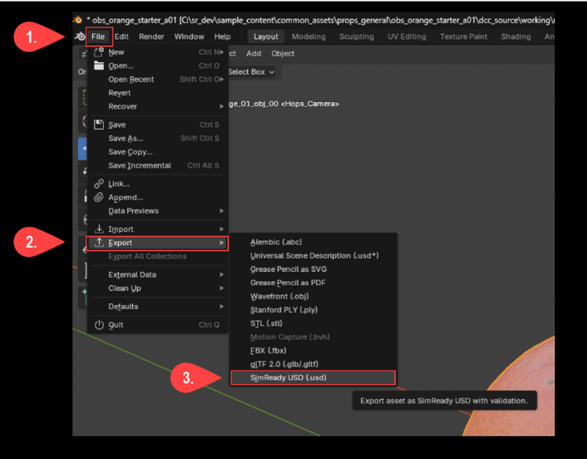

1. In the top menu bar, click **File. (1)**  
2. Click **Export. (2)**
3. Click the “**SimReady USD (.usd)**” button **(3)** to open the **SimReady AutoChecker** window.

   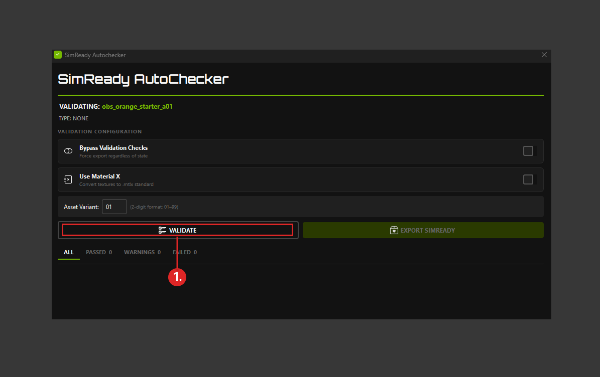

4. Click **VALIDATE (1)** in the AutoChecker window.

   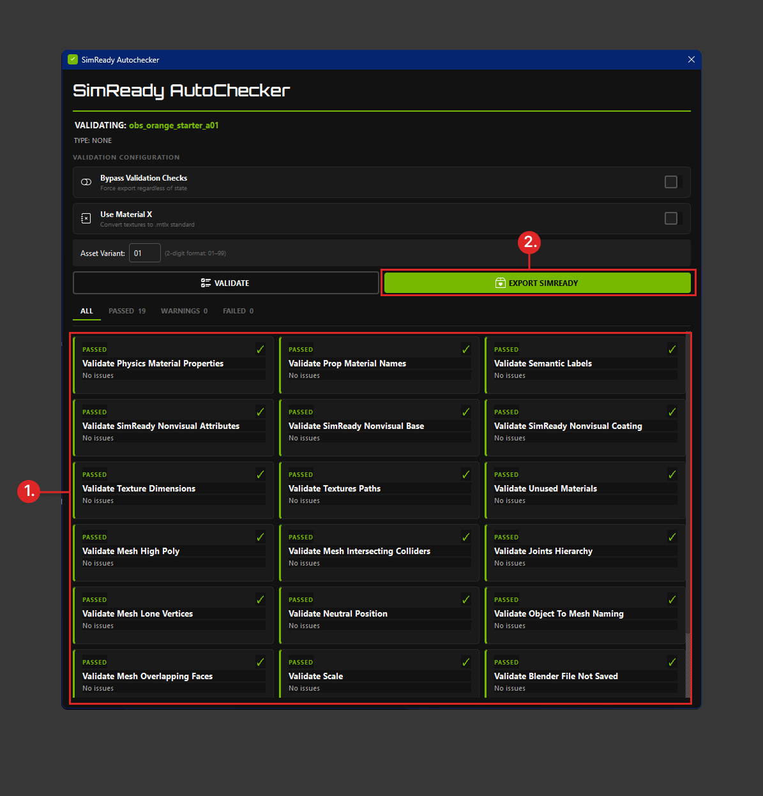

   When you click **VALIDATE**, several things happen:

   - Blender runs a number of autocheck rules **(1)**. Since this asset is a sample, the asset should pass all checks. Other guides will help explain what each checker is validating.  
   - When all the validation checks pass, Blender enables the **EXPORT SIMREADY** button (next to the **VALIDATE** button) and turns it bright green.
   
   **Important:** These checkers are specifically checking for properties within the Blender scene and are NOT the same as **SimReady Validations**. Most of these checks validate textures and meshes and not specific USD attributes.

5. When it is active, click the green **EXPORT SIMREADY** button **(2)**.  
      
   This opens a dialog box telling you that your asset has been exported successfully.

   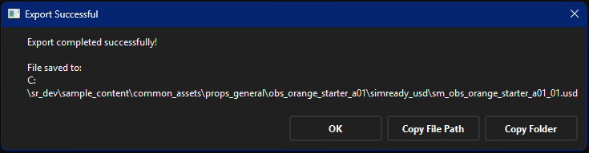

   **Note:** The export process automatically uses the project structure you initially set up, and creates a new top-level **/simready_usd** folder for storing your exported USD files. 

6. Click the **Copy File Path** button to copy the path to the clipboard. You need this later for command line work.  
7. Click **OK** to dismiss the dialog box.

You have now completed the Blender to SimReady USD export procedure. At this point, you would typically validate the 3D USD asset to ensure that it meets NVIDIA's SimReady standard for use in physical simulations. For validation of your asset, check the SimReady validation guide `<guide_link_to_be_determined>`.

## Video Guides

As this guide is just a simple starter to making a very simplistic SimReady uni-body prop asset, we are providing more bite-sized guides in the form of videos that you can download and watch. They serve as quick how-tos and reference for how to create different types of joints (fixed, prismatic, revolute), how to output logs (when debugging), and even how to find intersecting geometry (helpful when trying to make perfect colliders).

> Note: Video guides are available in the [`docs/faq_helpers`](./faq_helpers/) folder of the repository. Because GitHub does not play .mp4 files inline, you must download each video to view it. To watch a video, open its link in the following table, click **Download raw file** on the GitHub page, and play the downloaded file locally:

| # | Title | Video |
|---|-------|-------|
| 1 | How to install the CORE tool add-on | [1_How_to_install_core_tool_addon.mp4](./faq_helpers/1_How_to_install_core_tool_addon.mp4) |
| 2 | How to access CORE tool log files | [2_How_to_access_core_tool_log_files.mp4](./faq_helpers/2_How_to_access_core_tool_log_files.mp4) |
| 3 | How to create SimReady collections | [3_How_to_create_Sim_Ready_Collections.mp4](./faq_helpers/3_How_to_create_Sim_Ready_Collections.mp4) |
| 4 | How to import MJCF assets | [4_How_to_import_MJCF_assets.mp4](./faq_helpers/4_How_to_import_MJCF_assets.mp4) |
| 5 | How to add grasp points | [5_How_to_add_grasp_points.mp4](./faq_helpers/5_How_to_add_grasp_points.mp4) |
| 6 | How to create uni-body joints | [6_How_to_create_uni_body_joints.mp4](./faq_helpers/6_How_to_create_uni_body_joints.mp4) |
| 7 | How to set up fixed joints | [7_How_to_setup_fixed_joints.mp4](./faq_helpers/7_How_to_setup_fixed_joints.mp4) |
| 8 | How to set up revolute (hinge) joints | [8_How_to_setup_revolute(hinge)_joints.mp4](./faq_helpers/8_How_to_setup_revolute_joints.mp4) |
| 9 | How to set up prismatic joints | [9_How_to_setup_prismatic(slider)_joints.mp4](./faq_helpers/9_How_to_setup_prismatic_joints.mp4) |
| 10 | How to create folder structure automatically | [10_How_to_create_folder_structure_automatically.mp4](./faq_helpers/10_How_to_create_folder_structure_automatically.mp4) |
| 11 | How to find intersecting geometry | [11_How_to_find_intersecting_geometry.mp4](./faq_helpers/11_How_to_find_intersecting_geometry.mp4) |

## Troubleshooting

### Diagnostic Steps

1. Check if you missed any steps in the guide.
2. Check Notes and highlighted sections throughout the guide for assurance.

## Known Limitations of the Blender Add-on Exporter
1. **Mimic or Loop** joints are not supported yet. If you are trying to build a multi-body where one mesh needs to be **influenced** by more than one parent, then results will not be as expected. This is under development.
2. For **revolute joints** that need to have unlimited rotation (revolve freely on its chosen axis), **do not** set limits of the same number, which will lock the joint in place. Instead, utilize the **infinite-limit** toggle. Also be aware that (0,360) does **not** mean infinite rotation.
3. By default, physics joints are exported with **self-collisions** turned **off**. If you need **joint collisions**, you can toggle it back on in the USD. However, if you do turn on **joint collisions**, be sure to author your colliders correctly without intersections.
